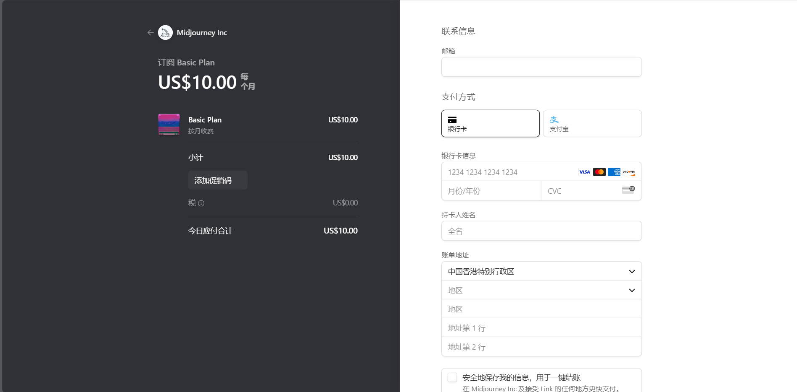
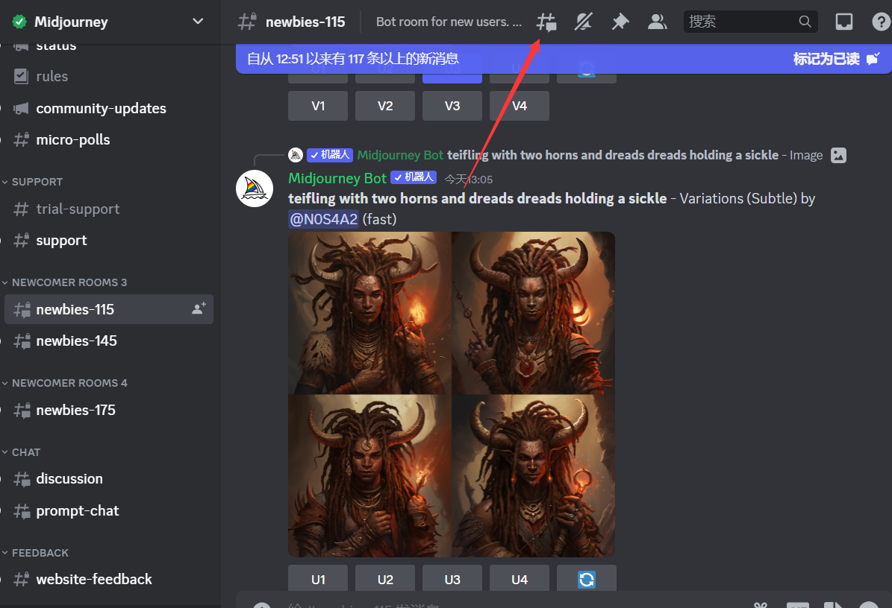
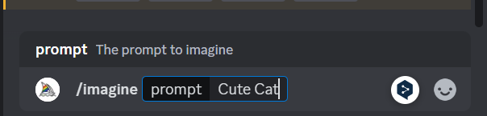
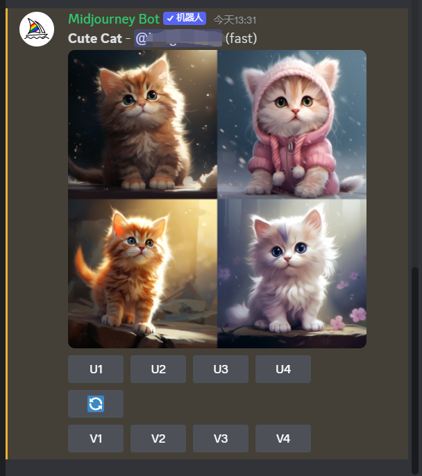

# 注册使用

首先我们进行 Midjourney 账号的注册使用教程。

## 注册

首先进入 Midjourney [官网](https://www.midjourney.com/)，等待过场动画加载完毕，点击右下角`Sign in`，在弹出的窗口中使用 discord 授权登录，之后根据自己的需求选择合适的订阅服务，你可以选择使用银行卡或者支付宝来支付订阅。

支付成功之后，点击[链接](https://discord.gg/midjourney)加入 Midjourney 的 discord，进入任何一个以`newbies`开头的子频道，即可开始使用了。

## 使用

在任何`newbies`子频道中点击右上角的`#`符号创建属于自己的子区用于生成图像，避免自己的图像被其他人生成的图像淹没。

在子区聊天框中键入`/imagine`命令，并按`Tab`补全，在接下来的提示框中输入自己的提示词，回车之后等待图像生成就可以啦！
下面以提示词`Cute Cat`为例。

在下一小节中，我们将开始学习 Midjourney 中的提示词应当如何编写。