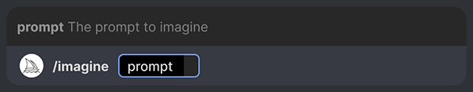
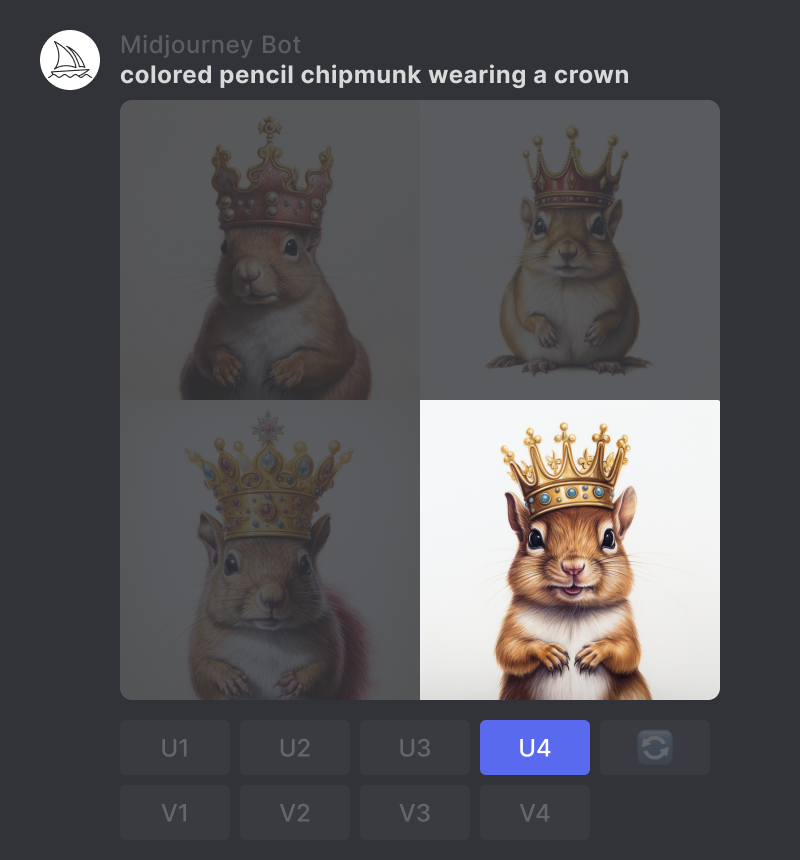
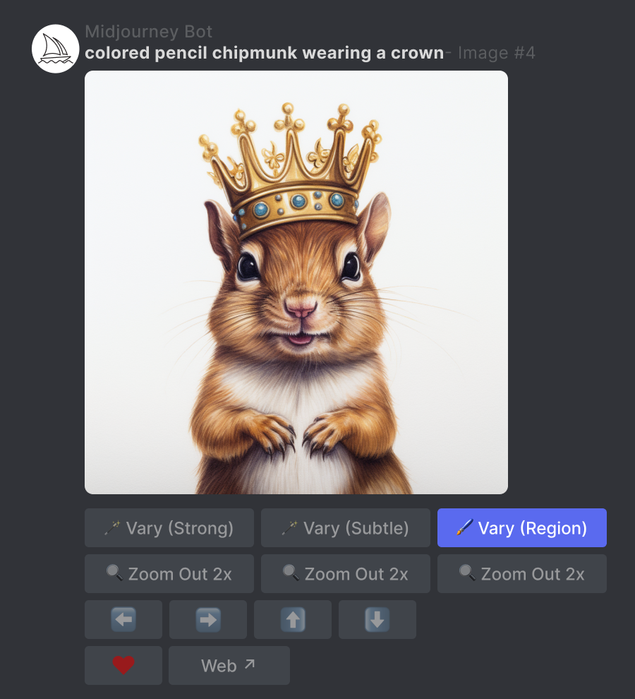
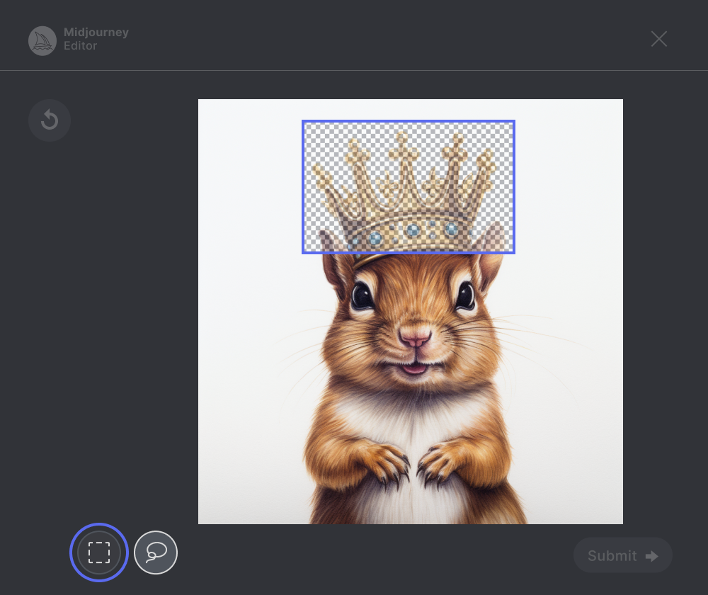
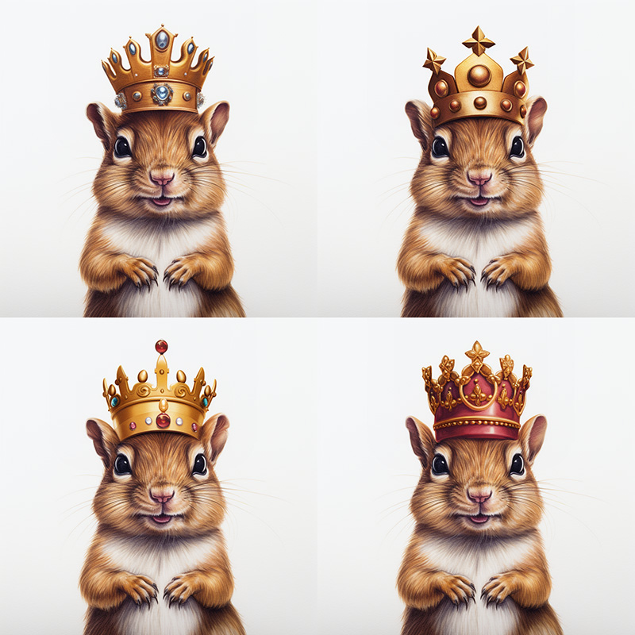

# 变化区域

变化区域（`Vary (Region)`）工具能够使用户使用 Midjourney 调整或替换图像局部区域。下面简述使用方法。

## 生成图像

使用`/imagine`命令创建图像。

## 放大图像

使用 U 按钮放大图像。

## 选择区域

点击`🖌️ Vary (Region)`按钮，打开编辑界面。

- 选择编辑器左下角的手绘或矩形选择工具。
- 选择要重新生成的图像区域。
  - 您选择的大小将影响您的结果。更大的选择为中途机器人提供了更多空间来生成新的创意细节。较小的选择将导致更小、更微妙的变化。
    注意：您无法编辑现有选择，但可以使用右上角的撤消按钮撤消多个步骤。

## 提交并查看结果

单击`Submit →`按钮将您的请求发送到 Midjourney Bot。现在可以关闭 Vary Region 编辑器，并且在处理作业时您可以返回 Discord。

**注意**`🖌️ Vary (Region)`您可以多次使用放大图像下方的按钮来尝试不同的选择。您之前的选择将被保留。您可以继续添加到此现有选择或使用`undo`按钮清除您的选择。

