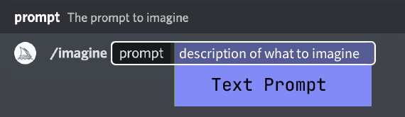

# 提示词编写

export const Highlight = ({children, color}) => (
    
      {children}
    
  );

提示词（prompt）是一段简短的文本短语，Midjourney 机器人会对其进行解释以生成图像。Midjourney 机器人会将提示中的单词和短语分解为更小的部分（称为标记），将其与其训练数据进行比较，然后用于生成图像。精心设计的提示词可以帮助制作独特且令人兴奋的图像。

在使用 AI 的过程中，提示词是一个非常重要的东西，一个好的提示词可以让你事半功倍，接下来，我们就将一起学习如何在 Midjourney 中编写合适的提示词。

## 基本提示词

基本提示词仅包含文字提示词，可以是简单的单词、短语或 Emoji😊。

:::tip

尽量使用简单、简短的句子来编写提示词。避免一长串的请求和指示。例如，不要使用：**给我展示一张大量盛开的武汉樱花的图片，将它们设置为明亮、充满活力的橙色，然后用彩色铅笔以插图风格绘制它们**，而是使用这样的提示词：**用彩色铅笔绘制明亮的橙色武汉樱花**

:::

## 高级提示词

高级提示词包括一个或多个图像 url 作为图像提示词，一个或多个文字提示词以及一个或多个[参数](../command-and-parameters#参数)。

  

    <h4 style={{}}><Highlight color="#79a70e">图像提示词</Highlight></h4>
    
可以将图像 URL 添加到提示词中以影响最终结果的样式和内容。图像提示词始终放在提示词的最前面。

  

  

    <h4><Highlight color="#828ef5">文字提示词</Highlight></h4>
    
您要生成的图像的文本描述。请参阅下面的提示信息和提示。精心编写的提示有助于生成令人惊叹的图像。

  

  

    <h4><Highlight color="#d97706">参数</Highlight></h4>
    
参数改变图像的生成方式。参数可以改变纵横比、模型、放大器等等。参数位于提示词末尾。

  

## 提示词说明

提示词使用英语效果最好，因此接下来的提示词描述都以英语为提示词进行解释。

### 选词

词语的选择很重要。在许多情况下，更具体的同义词效果更好。不要使用`big`，而是改用更具体的`tiny`、`huge`、`gigantic`、`enormous`或者`immerse`。

### 复数和集体名词

使用复数单词会造成很大的不确定性。尽量使用具体数字进行限定。例如`three cats`比`cats`更具体。集体名词也可以用“flock of Birds”代替“birds”。

### 专注于你想要的

最好描述你想要什么，而不是描述你不想要什么。如果你要求举办一个“没有蛋糕”的派对，你的形象可能会包括一个蛋糕。为了确保最终图像中没有对象，请尝试使用[`--no`参数](../command-and-parameters/#反向提示词)进行高级提示。

### 提示长度和详细信息

提示词可以很简单。一个单词或一个 Emoji 就可以了。提示词简单的话，Midjourney 会根据默认模型来补充图像信息。简单的提示词意味着图像具有更高的多样性以及更低的可预测性。如果你想让图像生成的更加精准的话，请更加精准的描述提示词。

下面的这些词可能对您的提示词编写有帮助：

- **Subject (主体):** person (人物), animal (动物), character (角色), location (地点), object (物体)
- **Medium (媒介):** photo (照片), painting (绘画), illustration (插图), sculpture (雕塑), doodle (涂鸦), tapestry (挂毯)
- **Environment (环境):** indoors (室内), outdoors (室外), on the moon (月球上), underwater (水下), in the city (在城市中)
- **Lighting (光照):** soft (柔和的), ambient (环境的), overcast (阴天的), neon (霓虹的), studio lights (工作室灯光)
- **Color (颜色):** vibrant (鲜艳的), muted (柔和的), bright (明亮的), monochromatic (单色的), colorful (多彩的), black and white (黑白的), pastel (淡彩的)
- **Mood (情绪)**: sedate (宁静的), calm (平静的), raucous (喧嚣的), energetic (充满活力的)
- **Composition (构图):** portrait (肖像), headshot (头像), closeup (特写), birds-eye view (鸟瞰视角)