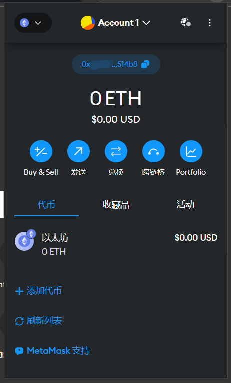
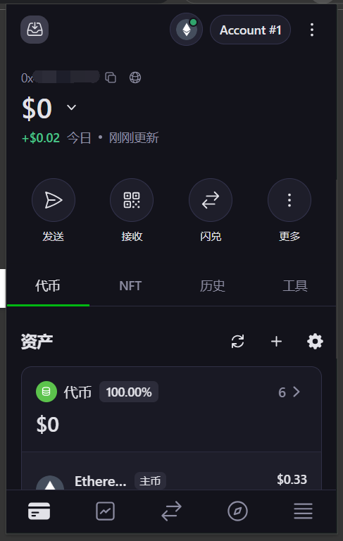
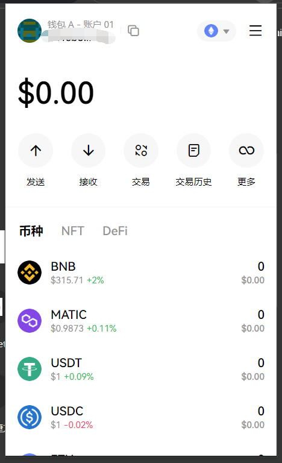
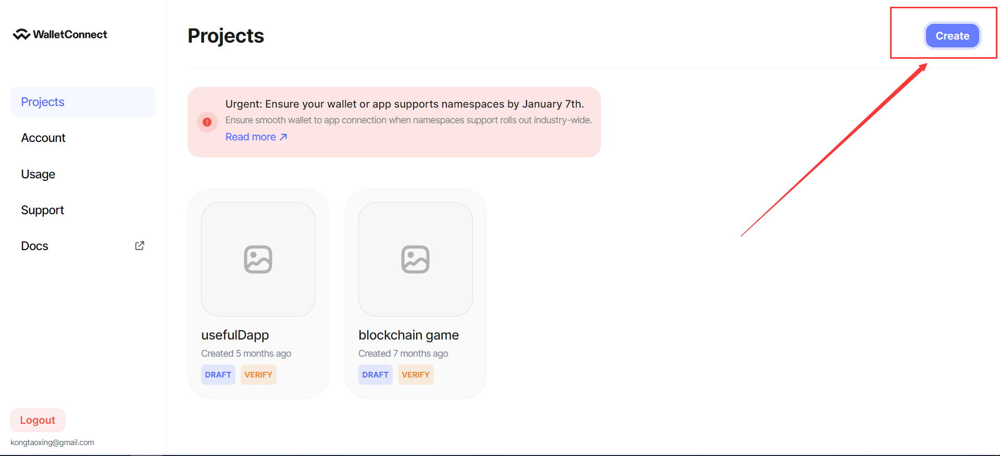
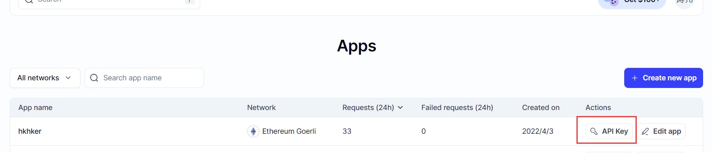
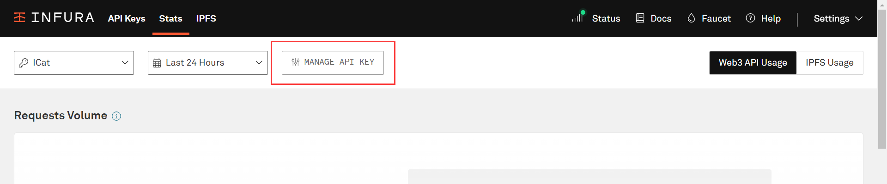
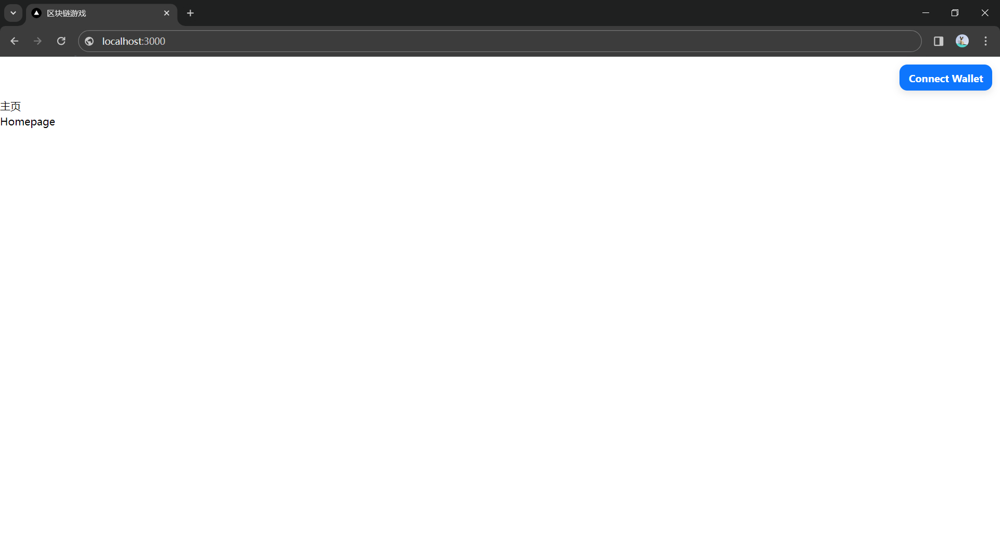
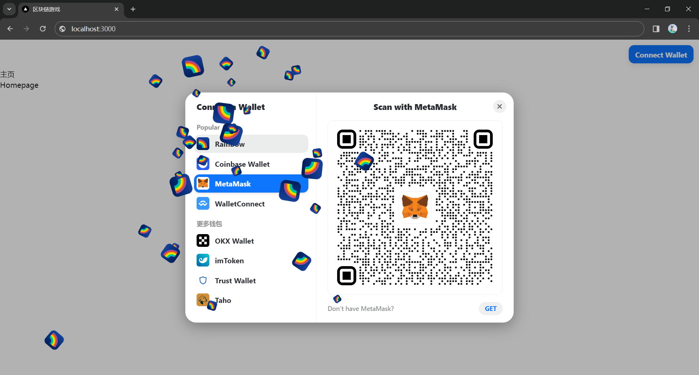

# 第一步：连接到区块链网络

作为一个去中心化应用（Decentralized APP，DAPP），最基本的功能当然是能连接到区块链网络并能够进行网络交互，本小节将教授如何使用 RainbowKit 连接到区块链网络。

## 在开始之前

在整个教程开始之前，我想要强调一下安全问题。

在准备学习区块链开发之前，你可能通过各种渠道了解过关于区块链各方面的信息，可能看到过很多项目或者个人因为疏忽或安全漏洞而丢失或被盗大量钱财。是的，区块链是一个伟大的发明，他带来了很多方面突破性的变革。但是，由于区块链天然具有开源的属性，因此，作为一个区块链的开发者和建设者，我们应该从一开始就具有很强的安全意识。就像在前面的智能合约开发中，我们使用 dotenv 来管理私钥和 api key，这样就可以防止失误将私钥上传到 github 或者 gitee 等开源平台上导致资产损失。

如果想要进一步了解关于区块链的安全问题，我们建议参考由知名安全公司慢雾（Slow Mist）编写的[区块链黑暗森林自救手册](https://darkhandbook.io/)，在该手册中，你可以看到大量的安全问题，并在日后的开发中主动将其避免，维护用户的资产安全。而且，由于区块链的发展还在早期，大量新老技术栈更迭迅速，黑客的攻击方式也在不断变化，因此作为一名开发人员，要时刻将安全问题放在心间。

接下来，我们正式进入 DAPP 开发的学习。

## 获取插件钱包

钱包作为连接 DAPP 与 区块链网络的桥梁，是必不可少的。因此，要编写 DAPP，我们首先需要获取一个钱包。现在市面上有很多优秀的钱包，包括 [Metamask](https://metamask.io/)、[Onekey](https://onekey.so/download?client=browserExtension)、[OKX Web3 钱包](https://chrome.google.com/webstore/detail/okx-wallet/mcohilncbfahbmgdjkbpemcciiolgcge)等，你可以根据喜好选择一款适合自己的钱包。上述提到的三种浏览器插件钱包的主界面如下图所示：





:::warning

请注意，通过搜索引引擎搜索并下载获得的钱包，很有可能是经过黑客改装的有后门的钱包，一定要多方核对包括官网地址、md5等确保钱包安全。

:::

下载好钱包之后，根据钱包的指示，创建一个新钱包并备份好助记词，就可以进行接下来的工作了。

## 配置钱包组件以连接到区块链

在本项目中，我们使用 RainbowKit 钱包组件连接到区块链网络，由于其组件中包含 wallet connect v2，因此我们需要先注册一个 v2 的 api key。

### 获取 WalletConnect Project ID

进入 WalletConnect [官方网站](https://cloud.walletconnect.com/)，按指示注册之后，通过下图创建一个新的 project ID，并复制备用。


### 获取 RPC

在以太坊区块链中，RPC（Remote Procedure Call） Provider 是一种允许开发者通过远程方式与以太坊节点进行通信的接口。RPC 提供程序允许应用程序通过发送 JSON-RPC 请求（Remote Procedure Call 基于 JSON 的协议）来与以太坊网络进行交互，从而实现在本地应用程序中访问区块链的功能。

在 DAPP 项目开发中，如果使用公共 RPC 节点，则有可能出现流量高时无法访问的情况，因此需要在 RPC 提供商处获取具有更高访问额度的节点。著名的节点提供商包括 Alchemy、infura、public node 等。这里我们同时使用 alchemy 和 infura。

#### 获取 alchemy api key

到 [alchemy 官网](https://dashboard.alchemy.com/)，根据提示注册账号，然后在[这里](https://dashboard.alchemy.com/apps)选择`Create new app`，创建成功后在下面红框处获取 api key 并复制备用。


#### 获取 infura api key
到 [infura 官网](https://www.infura.io/zh)，根据提示注册账号，然后在[这里](https://app.infura.io/)选择`CREATE NEW API KEY`，根据提示创建成功后，按顺序点击`VIEW STATS`、`MANAGE API KEY`，看到 api key 后复制备用。


### 配置`.env.local`

在项目根目录下创建`.env.local`文件，并将其加入`.gitignore`。之后打开该文件，粘贴以下代码：
```env
#environment
NODE_ENV=development

#envs
NEXT_PUBLIC_WALLETCONNECT_PROJECT_ID=
NEXT_PUBLIC_ALCHEMY_API_KEY=
NEXT_PUBLIC_INFURA_API_KEY=
```

并将刚才复制好的`walletconnect project ID`、`alchemy api key`以及`infura api key`分别粘贴进去。保存备用。

### 前端编写

在`app/`文件夹下创建文件`providers.jsx`，并粘贴如下代码：

```jsx showLineNumbers
'use client';

import * as React from 'react';

// rainbowkit login
import '@rainbow-me/rainbowkit/styles.css';
import { 
  connectorsForWallets, 
  getDefaultWallets, 
  RainbowKitProvider 
} from '@rainbow-me/rainbowkit';
import { 
  imTokenWallet, 
  trustWallet, 
  tahoWallet, 
  zerionWallet, 
  okxWallet
} from '@rainbow-me/rainbowkit/wallets';
import { 
  configureChains, 
  createConfig, 
  WagmiConfig 
} from 'wagmi';
import { 
  mainnet, 
  polygon, 
  optimism, 
  arbitrum, 
  arbitrumGoerli, 
  optimismGoerli 
} from 'wagmi/chains';
import { alchemyProvider } from 'wagmi/providers/alchemy';
import { infuraProvider } from 'wagmi/providers/infura';
import { publicProvider } from 'wagmi/providers/public';

const projectId = process.env.NEXT_PUBLIC_WALLETCONNECT_PROJECT_ID;

const { chains, publicClient, webSocketPublicClient } = configureChains(
    [
      mainnet,
      polygon,
      optimism,
      arbitrum,
      arbitrumGoerli,
      optimismGoerli,
    ],
    [
        alchemyProvider({apiKey: process.env.NEXT_PUBLIC_ALCHEMY_API_KEY}),
        infuraProvider({apiKey: process.env.NEXT_PUBLIC_INFURA_API_KEY}),
        publicProvider()
    ]
  );
  
  const { wallets } = getDefaultWallets({
    appName: 'iCat',
    projectId,
    chains,
  });

  const connectors = connectorsForWallets([
    ...wallets,
    {
      groupName: '更多钱包',
      wallets: [
        okxWallet({ projectId, chains }),
        imTokenWallet({ projectId, chains }),
        trustWallet({ projectId, chains }),
        tahoWallet({ projectId, chains }),
      ],
    },
  ]);
  
  const wagmiConfig = createConfig({
    autoConnect: true,
    connectors,
    publicClient,
    webSocketPublicClient,
  });

export function Providers({ children }) {
    const [mount, setMount] = React.useState(false);
    React.useEffect(() => setMount(true), []);
    return (
        <WagmiConfig config={wagmiConfig}>
            <RainbowKitProvider chains={chains} >
                {mount && children}
            </RainbowKitProvider>
        </WagmiConfig>
    )
}
```

将`layout.js`重命名为`layout.jsx`并将代码替换为：

```jsx
import './globals.css';
import '@rainbow-me/rainbowkit/styles.css';
// import { Inter } from 'next/font/google';
import { Providers } from './providers';
import { ConnectButton } from '@rainbow-me/rainbowkit';

// const inter = Inter({ subsets: ['latin'] })

export const metadata = {
  title: 'iCat',
  description: '基于AIGC的区块链游戏',
}

export default function RootLayout({ children }) {
  return (
    <html lang="en">
      <body>
        <Providers>
          <div style={{ display: 'flex', justifyContent: 'flex-end', padding: 12, }}>
              <ConnectButton />
          </div>
          {children}
        </Providers>
      </body>
    </html>
  )
}
```

将`page.js`重命名为`page.jsx`并将代码替换为：

```jsx
import * as React from "react";
import Link from "next/link";

const App = () => {
    return (
        <div>
            <h1>主页</h1>
            <Link href="/">Homepage</Link>
        </div>
    )
}

export default App;
```

将`globals.css`替换为下面的内容：

```css
@tailwind base;
@tailwind components;
@tailwind utilities;

body {
  -ms-overflow-style: none;
  overflow-x:hidden;
  scrollbar-width: none;
}
body::-webkit-scrollbar { 
  display: none;
}

::-webkit-scrollbar {
  display: none;
}

.split-line {
  overflow: hidden;
}

#gradient-canvas {
  width:100%;
  height:100%;
  --gradient-color-1: #CA363A;
  --gradient-color-2: #D83E40;
  --gradient-color-3: #C94337;
  --gradient-color-4: #D44D40;
}
```


:::tip

在以 React 为框架的前端项目中，以`.js`和`.jsx`为后缀名的文件的作用都是相同的。但是，在实际编写代码过程中，将 component 或者页面文件后缀名设置为`.jsx`，后端或其他一般的 js 文件后缀名设置为`.js`，更有利于文件管理和代码阅读。

:::

这时，在终端运行`npm run dev`，然后再浏览器打开[http://localhost:3000/](http://localhost:3000/)，看到如下界面证明启动成功。


这时，点击`Connect Wallet`，你可以尝试使用多种方式连接到浏览器插件钱包，或者通过 Wallet Connect 连接到移动端钱包。

### 更进一步

请注意，我们要编写的项目是一个区块链游戏，因此，体现趣味性是一件必要的事情，相比于以往的钱包组件，RainbowKit 看起来更加轻松活泼，另外，我们还可以让他变得更有趣。

将上述`providers.jsx`第84行处修改为下面的代码：

```jsx
<RainbowKitProvider chains={chains} coolMode >
    {mount && children}
</RainbowKitProvider>
```

保存之后，再次打开浏览器，点击`Connect Wallet`，看到不同了吗？是的，每一种钱包的 logo 都在放烟花，酷~


