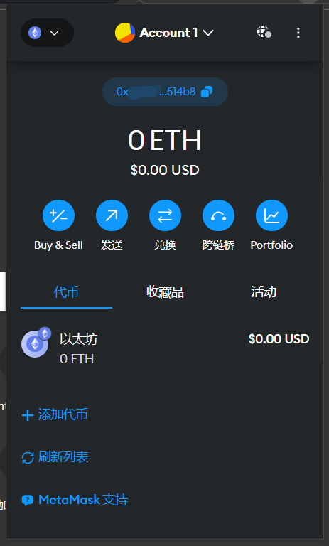
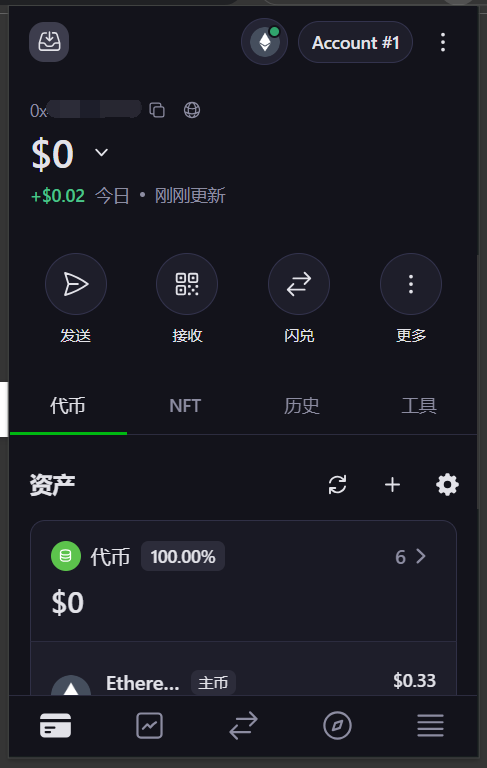
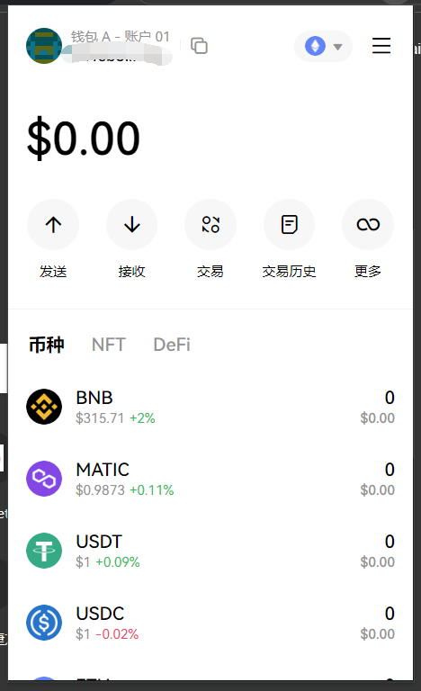
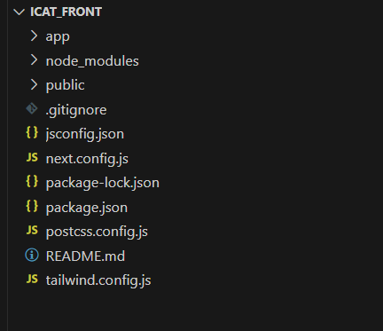

# 第一步：连接到区块链网络

作为一个去中心化应用（Decentralized APP，DAPP），最基本的功能当然是能连接到区块链网络并能够进行网络交互，本小节将教授如何使用 RainbowKit 连接到区块链网络。

## 在开始之前

在整个教程开始之前，我想要强调一下安全问题。

在准备学习区块链开发之前，你可能通过各种渠道了解过关于区块链各方面的信息，可能看到过很多项目或者个人因为疏忽或安全漏洞而丢失或被盗大量钱财。是的，区块链是一个伟大的发明，他带来了很多方面突破性的变革。但是，由于区块链天然具有开源的属性，因此，作为一个区块链的开发者和建设者，我们应该从一开始就具有很强的安全意识。就像在前面的智能合约开发中，我们使用 dotenv 来管理私钥和 api key，这样就可以防止失误将私钥上传到 github 或者 gitee 等开源平台上导致资产损失。

如果想要进一步了解关于区块链的安全问题，我们建议参考由知名安全公司慢雾（Slow Mist）编写的[区块链黑暗森林自救手册](https://darkhandbook.io/)，在该手册中，你可以看到大量的安全问题，并在日后的开发中主动将其避免，维护用户的资产安全。而且，由于区块链的发展还在早期，大量新老技术栈更迭迅速，黑客的攻击方式也在不断变化，因此作为一名开发人员，要时刻将安全问题放在心间。

接下来，我们正式进入 DAPP 开发的学习。

## 获取插件钱包

钱包作为连接 DAPP 与 区块链网络的桥梁，是必不可少的。因此，要编写 DAPP，我们首先需要获取一个钱包。现在市面上有很多优秀的钱包，包括 [Metamask](https://metamask.io/)、[Onekey](https://onekey.so/download?client=browserExtension)、[OKX Web3 钱包](https://chrome.google.com/webstore/detail/okx-wallet/mcohilncbfahbmgdjkbpemcciiolgcge)等，你可以根据喜好选择一款适合自己的钱包。上述提到的三种浏览器插件钱包的主界面如下图所示：

:::warning

请注意，通过搜索引引擎搜索并下载获得的钱包，很有可能是经过黑客改装的有后门的钱包，一定要多方核对包括官网地址、md5等确保钱包安全。

:::

下载好钱包之后，根据钱包的指示，创建一个新钱包并备份好助记词，就可以进行接下来的工作了。

## 认识文件架构

在上一小节中，我们创建了一个新的 Next.js 项目，文件架构如下图所示：

让我们逐个结束