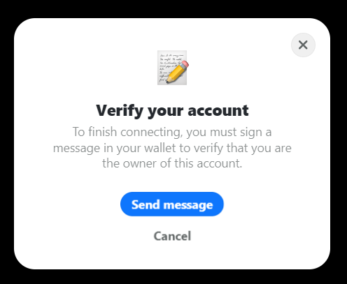
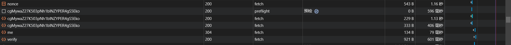

# 签名登录

在上一小节中，我们学习了如何通过 RainbowKit 连接到区块链网络，在本小节中，我们将继续利用 RainbowKit 编写签名登录。

## 为什么需要签名登录

在区块链应用中，签名登录是一种常见的身份验证方式，其主要原因包括安全性和去中心化的特性。以下是一些导致区块链应用选择签名登录的主要原因：


在区块链应用中，签名登录是一种常见的身份验证方式，其主要原因包括安全性和去中心化的特性。以下是一些导致区块链应用选择签名登录的主要原因：
1. **安全性：** 使用私钥签名具有较高的安全性。私钥是通过密码学算法生成的，具有足够的随机性和复杂性，因此很难被破解。签名登录的安全性主要取决于私钥的保管和使用的安全性，因此用户需要妥善保管其私钥。
2. **防止身份冒充：** 签名登录可以防止身份冒充，因为私钥是唯一授予对应账户权限的凭证。即使攻击者截获了登录请求，但由于没有正确的私钥进行签名，攻击者无法通过身份验证。
3. **无需用户名和密码：** 传统的用户名和密码登录存在被破解或泄露的风险。使用私钥签名登录不需要用户记忆复杂的密码，从而减少了安全风险。
4. **去中心化和无需信任第三方：** 区块链的设计理念强调去中心化和无需信任第三方。使用签名登录可以让用户在无需信任中介的情况下，直接与区块链进行交互。用户使用私钥对信息进行签名，证明了他们对账户的拥有权，而无需依赖中心化的身份验证服务。

## `Provider`是什么

在上一小节中，我们新建了一个名为`provider.jsx`的文件，并将所有的 RainbowKit 配置编写在了里面。那么，我们为什么要这么做呢？

在 React 中，`wrapper`通常指的是一个用于包裹组件或元素的容器组件或函数。Wrappers 在 React 中有多种用途，包括状态管理、样式包装、高阶组件（Higher Order Components，HOC）等。我们将 RainbowKit 编写的配置文件`provider`作为 wrapper，包裹在整个 app 之外，就能够将 RainbowKit 的配置应用于整个 app 上。

## 编写代码

根据上一段的讲述，基于 RainbowKit 的签名登录仍然应该写在`provider.jsx`中。对于签名登录，我们使用基于 EIP-4361开发的`siwe`库。

### 配置 siwe

在`.env.local`文件中创建新的环境变量项`NEXT_IRON_PASSWORD=`，然后创建一个至少32位的密码填在这里。

在项目根目录下创建`lib/`文件夹，在其中创建`iron.js`文件，添加如下代码，然后保存。

```js title="iron.js"
export const ironOptions = {
  cookieName: 'siwe',
  cookieOptions: {
    secure: process.env.NODE_ENV === 'production',
  },
  password: process.env.NEXT_IRON_PASSWORD,
};
```

### 编写后端接口

在根目录下创建文件夹`pages/api/`，之后创建`me.js`、`nonce.js`、`verify.js`以及`logout.js`，分别填入以下代码：

```js title="me.js"
import { withIronSessionApiRoute } from 'iron-session/next';
import { ironOptions } from './../../lib/iron';

const handler = async (req, res) => {
  const { method } = req;
  switch (method) {
    case 'GET':
      res.send({ address: req.session.siwe?.address });
      break;
    default:
      res.setHeader('Allow', ['GET']);
      res.status(405).end(`Method ${method} Not Allowed`);
  }
};

export default withIronSessionApiRoute(handler, ironOptions);
```

```js title="nonce.js"
import { withIronSessionApiRoute } from 'iron-session/next';
import { generateNonce } from 'siwe';
import { ironOptions } from './../../lib/iron';

const handler = async (req, res) => {
  const { method } = req;
  switch (method) {
    case 'GET':
      req.session.nonce = generateNonce();
      await req.session.save();
      res.setHeader('Content-Type', 'text/plain');
      res.send(req.session.nonce);
      break;
    default:
      res.setHeader('Allow', ['GET']);
      res.status(405).end(`Method ${method} Not Allowed`);
  }
};

export default withIronSessionApiRoute(handler, ironOptions);
```

```js title="verify.js"
import { withIronSessionApiRoute } from 'iron-session/next';
import { SiweMessage } from 'siwe';
import { ironOptions } from './../../lib/iron';

const handler = async (req, res) => {
  const { method } = req;
  switch (method) {
    case 'POST':
      try {
        const { message, signature } = req.body;
        const siweMessage = new SiweMessage(message);
        const { success, error, data } = await siweMessage.verify({
          signature,
        });

        if (!success) throw error;

        if (data.nonce !== req.session.nonce)
          return res.status(422).json({ message: 'Invalid nonce.' });

        req.session.siwe = data;
        await req.session.save();
        res.json({ ok: true });
      } catch (_error) {
        res.json({ ok: false });
      }
      break;
    default:
      res.setHeader('Allow', ['POST']);
      res.status(405).end(`Method ${method} Not Allowed`);
  }
};

export default withIronSessionApiRoute(handler, ironOptions);
```

```js title="logout.js"
import { withIronSessionApiRoute } from 'iron-session/next';
import { ironOptions } from './../../lib/iron';

const handler = async (req, res) => {
  const { method } = req;
  switch (method) {
    case 'GET':
      req.session.destroy();
      res.send({ ok: true });
      break;
    default:
      res.setHeader('Allow', ['GET']);
      res.status(405).end(`Method ${method} Not Allowed`);
  }
};

export default withIronSessionApiRoute(handler, ironOptions);
```

以上四个文件用于签名登录的后端响应。

### 前端设置

打开`app/provider.jsx`，将代码扩展为下面的代码：

<details>
  <summary>`provider.jsx`，<u>点击展开</u></summary>
  <div>
    ```jsx title="provider.jsx"
    'use client';

    import * as React from 'react';
    
    // rainbowkit login
    import '@rainbow-me/rainbowkit/styles.css';
    import { 
      connectorsForWallets, 
      getDefaultWallets, 
      RainbowKitProvider,
      createAuthenticationAdapter,
      RainbowKitAuthenticationProvider,
      AuthenticationStatus
    } from '@rainbow-me/rainbowkit';
    import { 
      imTokenWallet, 
      trustWallet, 
      tahoWallet, 
      okxWallet
    } from '@rainbow-me/rainbowkit/wallets';
    import { SiweMessage } from 'siwe';
    import { 
      configureChains, 
      createConfig, 
      WagmiConfig 
    } from 'wagmi';
    import { 
      mainnet, 
      polygon, 
      optimism, 
      arbitrum, 
      arbitrumGoerli, 
      optimismGoerli 
    } from 'wagmi/chains';
    import { alchemyProvider } from 'wagmi/providers/alchemy';
    import { infuraProvider } from 'wagmi/providers/infura';
    import { publicProvider } from 'wagmi/providers/public';
    
    const projectId = process.env.NEXT_PUBLIC_WALLETCONNECT_PROJECT_ID;
    
    const { chains, publicClient, webSocketPublicClient } = configureChains(
        [
          mainnet,
          polygon,
          optimism,
          arbitrum,
          arbitrumGoerli,
          // optimismGoerli,
        ],
        [
            alchemyProvider({apiKey: process.env.NEXT_PUBLIC_ALCHEMY_API_KEY}),
            infuraProvider({apiKey: process.env.NEXT_PUBLIC_INFURA_API_KEY}),
            publicProvider()
        ]
      );
    
      const { wallets } = getDefaultWallets({
        appName: 'iCat',
        projectId,
        chains,
      });
    
      const connectors = connectorsForWallets([
        ...wallets,
        {
          groupName: '更多钱包',
          wallets: [
            okxWallet({ projectId, chains }),
            imTokenWallet({ projectId, chains }),
            trustWallet({ projectId, chains }),
            tahoWallet({ projectId, chains }),
          ],
        },
      ]);
    
      const wagmiConfig = createConfig({
        autoConnect: true,
        connectors,
        publicClient,
        webSocketPublicClient,
      });
    
    const getSiweMessageOptions = () => ({
      statement: '登录iCat',
    });
    
    export function Providers({ children }) {
        const [mount, setMount] = React.useState(false);
        const fetchingStatusRef = React.useRef(false);
        const verifyingRef = React.useRef(false);
        const [authStatus, setAuthStatus] = React.useState('loading');
    
        React.useEffect(() => {
          setMount(true);
        
          // fetch user when
          const fetchStatus = async () => {
            if (fetchingStatusRef.current || verifyingRef.current) {
              return;
            }
        
            fetchingStatusRef.current = true;
        
            try {
              const responce = await fetch('/api/me');
              const json = await responce.json();
              setAuthStatus(json.address ? 'authenticated' : 'unauthenticated');
              // console.log('address: ', json.address)
            }
            catch (e) {
              console.log(e);
              setAuthStatus('unauthenticated');
            }
            finally {
              fetchingStatusRef.current = false;
            }
          }
        
          // 1.refresh
          fetchStatus();
        
          // 2.window is focused (in case user logs out of another window)
          window.addEventListener('focus', fetchStatus);
          return () => window.removeEventListener('focus', fetchStatus);
        }, []);


        const getNonce = async () => {
          const response = await fetch('/api/nonce');
          return await response.text();
      }
    
      const createMessage = ({ nonce, address, chainId }) => {
          return new SiweMessage({
            domain: window.location.host,
            address,
            statement: '登录iCat',
            uri: window.location.origin,
            version: '1',
            chainId,
            nonce,
          });
        }
    
      const getMessageBody = ({ message }) => {
          return message.prepareMessage();
        }
    
      const verify = async ({ message, signature }) => {
          verifyingRef.current = true;
    
          try {
            const response = await fetch('/api/verify', {
              method: 'POST',
              headers: { 'Content-Type': 'application/json' },
              body: JSON.stringify({ message, signature }),
            });
          
            const authenticated = Boolean(response.ok);
          
            if (authenticated) {
              setAuthStatus(authenticated ? 'authenticated' : 'unauthenticated');
            }
          
            return authenticated;
          } catch (error) {
            return false;
          } finally {
            verifyingRef.current = false;
          }
        }
    
      const signOut = async () => {
          setAuthStatus('unauthenticated');
          await fetch('/api/logout');
        }
    
      const authAdapter = React.useMemo(() => {
          return createAuthenticationAdapter({ getNonce, createMessage, getMessageBody, verify, signOut});
        }, []);


        return (
            <WagmiConfig config={wagmiConfig}>
              <RainbowKitAuthenticationProvider 
                getSiweMessageOptions={getSiweMessageOptions}
                adapter={authAdapter}
                status={authStatus}
              >
                <RainbowKitProvider chains={chains} showRecentTransactions={true} coolMode >
                    {mount && children}
                </RainbowKitProvider>
              </RainbowKitAuthenticationProvider>
            </WagmiConfig>
        )
    }
    ```
  </div>
</details>

保存之后，在前端断开刚在上个小节中连接好的钱包，再次点击链接钱包，在链接之后，会弹出下面的对话框：


点击`Send message`，并在钱包中签名，登录成功，通过开发人员工具，我们也可以清晰地看到在签名过程中调用的后端接口的过程。


至此，签名登录功能编写完成。下一小节，我们将开始学习编写 Landing Page。