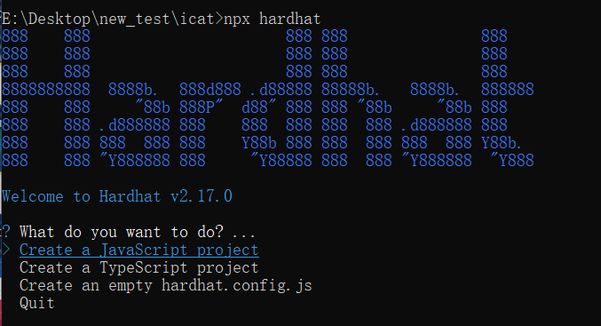

# 安装环境依赖

通过本小节的学习，你将学会使用hardhat对智能合约进行本地部署和测试。

## 安装本地环境

本项目采用 **hardhat** 进行智能合约的开发测试工作，由于 hardhat 是一款基于 node.js 的工具，在开始本项目之前，你应该确保电脑上有 node.js 环境，如果还没有安装的话，参考[这里](https://hardhat.org/tutorial/setting-up-the-environment)安装。

:::tip

实际上，基于rust编写的开发测试工具foundry，正在逐渐受到开发者们的欢迎，如果想要进一步学习，可以参考[官方文档](https://book.getfoundry.sh/)。

:::

接下来，让我们打开终端，在工作目录中输入以下命令：

```shell
npx hardhat
```

你将看到类似下面截图的画面



直接回车选择创建一个JavaScript项目，之后后面几项都直接回车确认，直到该命令执行结束，之后输入`code .`回车开始使用VSCode编辑该项目。

在工作目录下，你可以看到如下的工作树


为了防止软件包版本不同导致接下来的教程失效，将上图中的`package.json`文件内容全部删除，然后替换为以下内容并保存：

```json title="package.json"
{
  "devDependencies": {
    "@nomicfoundation/hardhat-toolbox": "^1.0.2",
    "@nomiclabs/hardhat-etherscan": "^3.1.7",
    "hardhat": "^2.14.0"
  },
  "dependencies": {
    "@openzeppelin/contracts": "^4.9.1",
    "dotenv": "^16.3.1"
  }
}

```

之后在终端执行`npm install`，等待安装完成。


## 运行项目

将`scripts`文件夹下的`deploy.js`内容全部删除，然后替换为以下代码：

```js title="deploy.js"
// We require the Hardhat Runtime Environment explicitly here. This is optional
// but useful for running the script in a standalone fashion through `node <script>`.
//
// You can also run a script with `npx hardhat run <script>`. If you do that, Hardhat
// will compile your contracts, add the Hardhat Runtime Environment's members to the
// global scope, and execute the script.
const hre = require("hardhat");

async function main() {
  const currentTimestampInSeconds = Math.round(Date.now() / 1000);
  const unlockTime = currentTimestampInSeconds + 60;

  const lockedAmount = hre.ethers.utils.parseEther("0.001");

  const lock = await hre.ethers.deployContract("Lock", [unlockTime], {
    value: lockedAmount,
  });

  await lock.deployed();

  console.log(
    `Lock with ${ethers.utils.formatEther(
      lockedAmount
    )}ETH and unlock timestamp ${unlockTime} deployed to ${lock.address}`
  );
}

// We recommend this pattern to be able to use async/await everywhere
// and properly handle errors.
main().catch((error) => {
  console.error(error);
  process.exitCode = 1;
});


```


在终端运行下面代码：

```shell
npx hardhat run ./scripts/deploy.js
```

可以看到下图的正确运行提示，这就说明hardhat开发测试环境安装成功。


在下一小节中，我们将正式开始智能合约的开发。