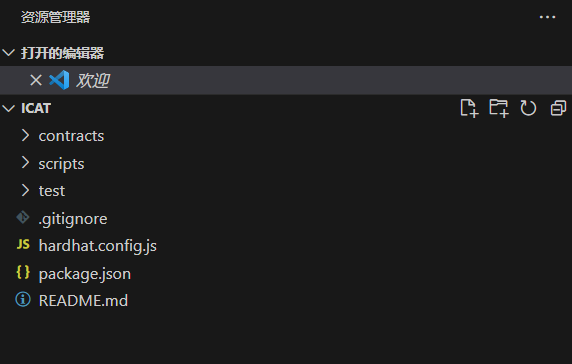

# Install Environment Dependencies

Through this section, you will learn how to use Hardhat for local deployment and testing of smart contracts.
## Install Local Environment

This project uses **Hardhat**  for smart contract development and testing. Since Hardhat is a tool based on Node.js, you should ensure that Node.js is installed on your computer before starting this project. If you haven't installed it yet, refer to [this link](https://hardhat.org/tutorial/setting-up-the-environment)  for installation.

:::tip

In fact, the development and testing tool foundry, based on Rust, is gradually gaining popularity among developers. If you want to further explore, you can refer to the [official documentation](https://book.getfoundry.sh/) .

:::

Next, let's open the terminal and enter the following command in the working directory:

```shell
npx hardhat
```


You will see a screen similar to the screenshot below:

 


Press Enter to choose to create a JavaScript project. After that, press Enter to confirm the following options until the command execution is complete. Then, enter `code .` and press Enter to start using VSCode to edit this project.

In the working directory, you will see a working tree like the one below:

 


To prevent potential issues due to different package versions, delete all contents in the `package.json` file shown above and replace it with the following content:

```json
{
  "devDependencies": {
    "@nomicfoundation/hardhat-toolbox": "^1.0.2",
    "@nomiclabs/hardhat-etherscan": "^3.1.7",
    "hardhat": "^2.14.0"
  },
  "dependencies": {
    "@openzeppelin/contracts": "^4.9.1",
    "dotenv": "^16.3.1"
  }
}
```


Then, in the terminal, execute `npm install` and wait for the installation to complete.

 

## Run the Project

Delete all contents in the `deploy.js` file under the `scripts` folder and replace it with the following code:

```js
// We require the Hardhat Runtime Environment explicitly here. This is optional
// but useful for running the script in a standalone fashion through `node <script>`.
//
// You can also run a script with `npx hardhat run <script>`. If you do that, Hardhat
// will compile your contracts, add the Hardhat Runtime Environment's members to the
// global scope, and execute the script.
const hre = require("hardhat");

async function main() {
  const currentTimestampInSeconds = Math.round(Date.now() / 1000);
  const unlockTime = currentTimestampInSeconds + 60;

  const lockedAmount = hre.ethers.utils.parseEther("0.001");

  const lock = await hre.ethers.deployContract("Lock", [unlockTime], {
    value: lockedAmount,
  });

  await lock.deployed();

  console.log(
    `Lock with ${ethers.utils.formatEther(
      lockedAmount
    )}ETH and unlock timestamp ${unlockTime} deployed to ${lock.address}`
  );
}

// We recommend this pattern to be able to use async/await everywhere
// and properly handle errors.
main().catch((error) => {
  console.error(error);
  process.exitCode = 1;
});
```


Then, run the following code in the terminal:

```shell
npx hardhat run ./scripts/deploy.js
```


You should see a successful run message as shown in the image below, indicating that the Hardhat development and testing environment has been successfully installed.

 


In the next section, we will officially start developing the smart contracts.
