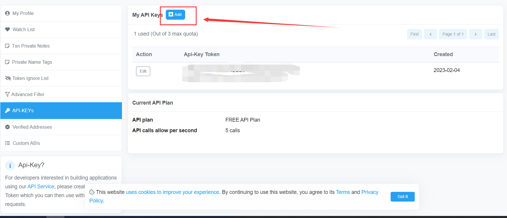
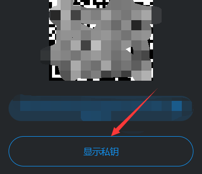
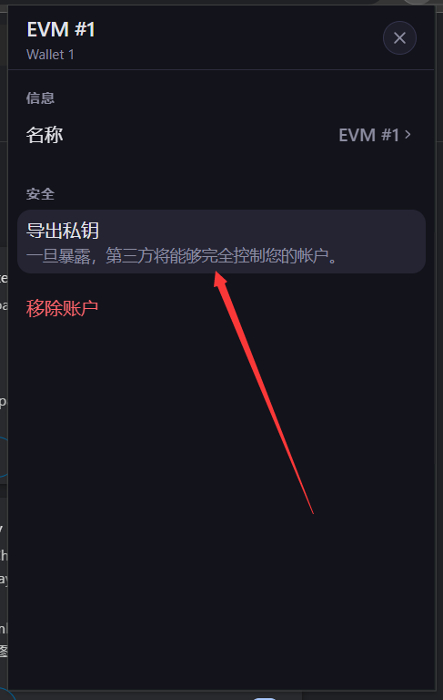

# Deploy the Contracts on Chain

在前面的学习中，我们完成了游戏智能合约端的开发。现在，我们要把经过测试的智能合约部署上链。

## 安装并配置 dotenv

dotenv 是一个用于加载包含敏感信息的环境变量的工具库。在将智能合约部署上链的过程中，我们会用到钱包私钥以及区块浏览器的 api key，因此，我们需要安装 dotenv。

在终端运行以下命令：

```sh
npm install dotenv
```

在项目根目录下创建新文件`.env`，在其中输入以下内容：

```log
ETHERSCSN_API_KEY=
PRIVATE_KEY=
```

### 获取区块浏览器的 api key

我们会将智能合约部署在 arbitrum goerli 测试网上，因此想要在区块浏览器上方便的开源合约的话，需要获取 arbiscan 的 api key。首先到 [arbiscan](https://arbiscan.io/) 上注册一个账号，然后跳转到[api页面](https://arbiscan.io/myapikey)，从下图处获取 api key 并填入`.env`文件相应位置。


### 获取钱包私钥

使用 [metamask](https://metamask.io/)、[onekey](https://onekey.so/zh_CN/download) 等钱包创建一个新的钱包，然后将钱包私钥导出，填在`.env`文件的相应位置。



## 配置 hardhat

打开`hardhat.config.js`，将其替换为以下内容：

```js
require("@nomicfoundation/hardhat-toolbox");
require("@nomiclabs/hardhat-etherscan");
require("dotenv").config();

/** @type import('hardhat/config').HardhatUserConfig */
module.exports = {
    networks: {
      arbitrumGoerli: {
        url: "https://goerli-rollup.arbitrum.io/rpc",
        accounts: [process.env.PRIVATE_KEY],
      },
    },
    etherscan: {
      apiKey: process.env.ETHERSCSN_API_KEY,
  },
  solidity: {
    version: "0.8.17",
    settings: {
      optimizer: {
        enabled: true,
        runs: 999999,
      },
    },
  },
};
```

保存之后即可。

## 部署合约

在`scripts`文件夹下创建`deploy.js`文件，并粘贴以下内容：

```js
const { ethers } = require("hardhat");

const main = async () => {
  const [deployer] = await ethers.getSigners();

  console.log("Deploying contracts with the account:", deployer.address);

  const icat = await ethers.deployContract("iCat");

  console.log("icat address:", icat.address);

  const egg = await ethers.deployContract("iCatEgg", [icat.address]);

  console.log("egg address:", egg.address);

  // 设置蛋的合约进猫的合约中
  await icat.setEggContract(egg.address);
  console.log("set successfully");
  
  // 赋予权限
  await icat.grantHatch(egg.address);
  console.log("grant successful");
}

const runMain = async () => {
  try {
    await main();
    process.exit(0);
  } catch (error) {
    console.log(error);
    process.exit(1);
  }
}

runMain();
```

保存后，在终端执行`npx hardhat run scripts/deploy.js --network arbitrumGoerli`，能够正确输出`icat`以及`icategg`部署的合约地址，即证明部署成功。

## 开源合约

区块链天然带有开源属性，但是如果项目方并不愿意将代码开源的话，反编译合约的字节码来获取合约具体内容是有一定难度的，因此主动开源合约是一种能够提高用户信任度的行为。

我们的游戏项目，用到了很多第三方库，因此要在区块浏览器的前端进行合约的开源就会非常麻烦。这时，我们就可以使用 hardhat 提供的合约开源功能进行操作。

在终端执行以下命令：

```sh
npx hardhat verify --network arbitrumGoerli <ICAT_CONTRACT_ADDRESS> 
npx hardhat verify --network arbitrumGoerli <EGG_CONTRACT_ADDRESS> <ICAT_CONTRACT_ADDRESS>
```

等待提示成功之后即可。这时，就可以在[区块浏览器](https://goerli.arbiscan.io/)上通过搜索合约地址来获取合约代码和进行链上交互了。

至此，智能合约的部分介绍完毕。
