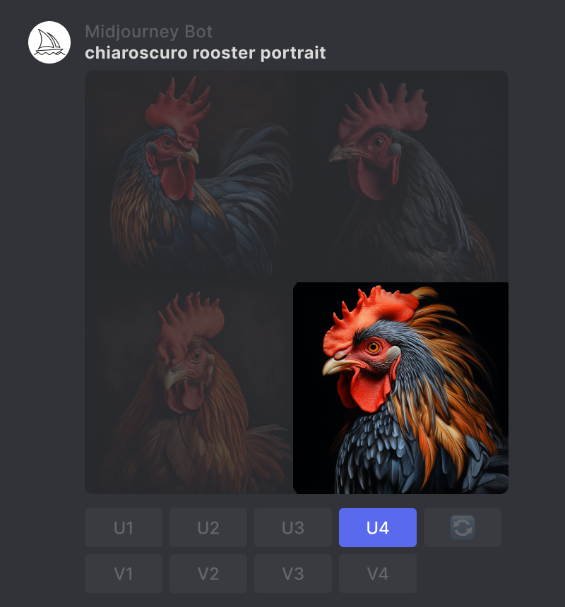
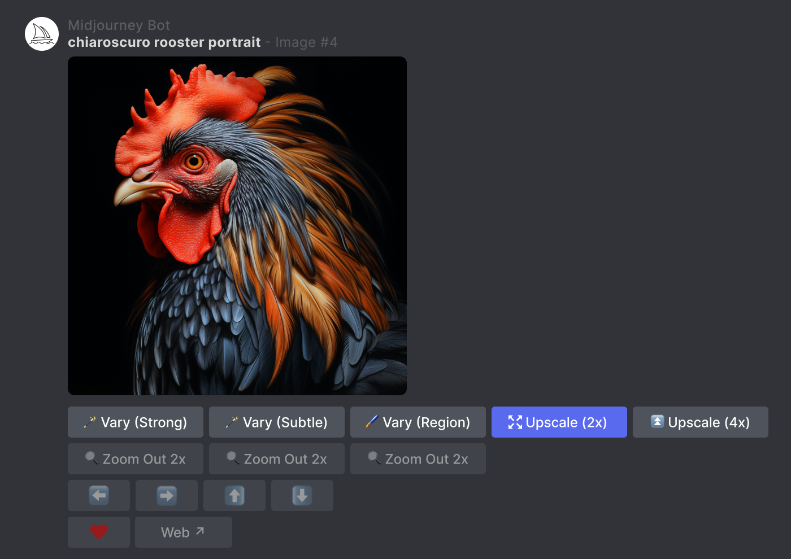

import origin from "./img/MJ_V52_Upscale_Chicken_Up1X.jpg";
import after from "./img/MJ_V52_Upscale_Chicken_Up2X.jpg";

# 扩大器

扩大器（Upscalers）用于提升图像分辨率。下面介绍如何使用。

## 生成图像

使用`/imagine`命令创建图像。

## 放大图像

使用 U 按钮将所选图像与网格分开。

## 选择档位

单击该`Upscale`按钮可提升您图像的分辨率。这里我们选择将分辨率提升一倍。

## 图像细节比较

下面展示放大前后图像细节。

  

    
原图

    
  

  

    
放大后

    
  

