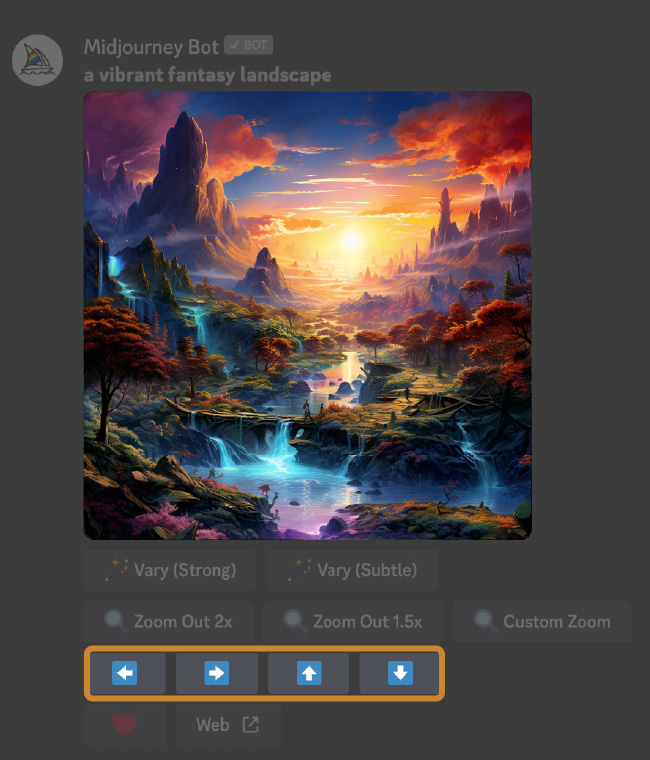

import start from "./img/pan_start_a.png";
import up from "./img/pan_up_a.png";
import down from "./img/pan_down_a.png";
import left from "./img/pan_left_a.png";
import right from "./img/pan_right_a.png";

# 扩展图像

“平移（Pan）”选项允许您沿选定方向扩展图像的画布，而不更改原始图像的内容。新扩展的画布将使用提示和原始图像的指导进行填充。

## 使用

[提高图像分辨率](../upscalers/)之后将出现`⬅️` `➡️` `⬆️` `⬇️`四个平移按钮。平移时，仅使用距离图像侧面最近的 512 个像素以及提示词来确定新部分。

`提示词：A vibrant fantasy landscape`

  

    
起始图像

    
  

  

    
向上平移

    
  

  

    
向下平移

    
  

  

    
向左平移

    
  

  

    
向右平移

    
  

