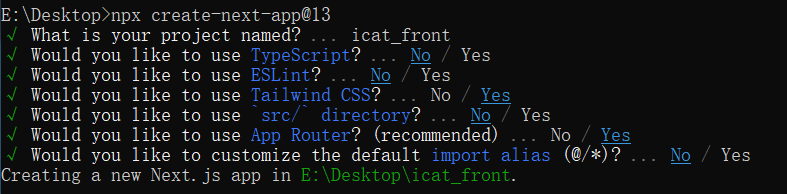
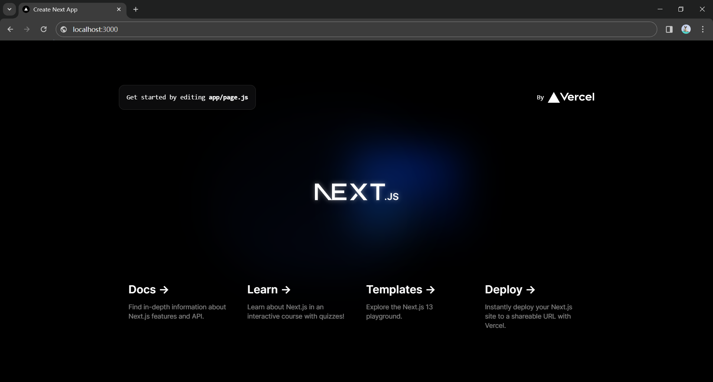

# 安装环境依赖

通过本小节的学习，你将能够使用 next.js 框架构建一个简单的前端。

## 安装本地环境

已经完成[这里](../../smart-contract/install-dependence/#安装本地环境)教程的同学们，电脑中应该已经有 node.js 环境了。接下来，在工作目录中打开终端，执行以下命令：

```sh
npx create-next-app@13
```

首次执行的时候根据指令安装`create-next-app`包，之后按照下图选择选项：


等待命令执行完成之后，分别执行`cd icat_front`和`code .`用 VSCode 打开项目。可以看到项目的文件结构如下图所示：


### 文件架构介绍

现在，让我们逐个了解各个文件夹和文件的作用

### `app`

`app`文件夹存放着页面组件。每个文件夹下可以有`page.jsx`和`layout.jsx`两个文件，`page.jsx`对应该文件夹的路由，`layout.jsx`用于设置该路由的框架。另外，`app`文件夹根目录下的`page.jsx`用于编写默认路由（即`./`），`layout.jsx`用于设置适用于所有页面的框架。

### `node_modules`

用于存放项目依赖的 npm 模块，通过 `package.json` 中的配置安装。

### `public`

 用于存放静态资源，例如图片、字体等。这些文件不会经过Webpack处理，而是直接被复制到构建输出目录。

### `.gitignore`

 Git 忽略配置文件，指定了不需要纳入版本控制的文件或目录。比如，我们可以将`.env`文件设置到`.gitignore`当中。

### `jsconfig.json`、`next.config.json`、`postcss.config.js`、`tailwind.config.js`

Next.js 以及 tailwindcss 等的配置文件。

### 其他文件夹

在接下来的代码编写过程中，我们还会用到`component/`文件夹以用于编写可重用的 React 组件；`lib/`文件夹以存放项目用到的库；`pages/api/`文件夹以存放用于和数据库交互的后端代码。

为了防止软件包版本不同导致接下来的教程失效，将上图中的`package.json`文件内容全部删除，然后替换为以下内容并保存：

```json title="package.json"
{
  "name": "icat_front",
  "version": "1.0.0",
  "description": "frontend of blockchain game",
  "scripts": {
    "dev": "next dev",
    "build": "next build",
    "start": "next start",
    "lint": "next lint"
  },
  "author": "",
  "license": "ISC",
  "keywords": [
    "blockchain",
    "game",
    "AIGC"
  ],
  "dependencies": {
    "@ant-design/icons": "^5.2.5",
    "@rainbow-me/rainbowkit": "^1.0.1",
    "@rainbow-me/rainbowkit-siwe-next-auth": "^0.2.0",
    "@reduxjs/toolkit": "^1.9.5",
    "@supabase/supabase-js": "^2.25.0",
    "antd": "^5.8.3",
    "antd-img-crop": "^4.12.2",
    "buffer": "^6.0.3",
    "dotenv": "^16.0.3",
    "embla-carousel-autoplay": "^8.0.0-rc11",
    "embla-carousel-react": "^8.0.0-rc11",
    "ethers": "^5.7.2",
    "iron-session": "^6.3.1",
    "next": "^13.4.4",
    "next-auth": "^4.20.1",
    "react": "^18.2.0",
    "react-dom": "^18.2.0",
    "react-hot-toast": "^2.4.1",
    "react-redux": "^8.1.2",
    "siwe": "^2.1.4",
    "uuid": "^9.0.0",
    "viem": "^0.3.37",
    "wagmi": "^1.0.7"
  },
  "devDependencies": {
    "autoprefixer": "^10.4.14",
    "encoding": "^0.1.13",
    "postcss": "^8.4.27",
    "supports-color": "^8.1.1",
    "tailwindcss": "^3.3.3"
  },
  "browserslist": {
    "production": [
      ">0.5%",
      "not dead",
      "not op_mini all"
    ],
    "development": [
      "last 1 chrome version",
      "last 1 firefox version",
      "last 1 safari version"
    ]
  },
  "engines": {
    "node": ">=18.0"
  }
}

```

之后在终端执行`npm install`，等待安装完成。

## 启动项目

在终端运行以下命令：

```sh
npm run dev
```

然后在浏览器打开 [http://localhost:3000/](http://localhost:3000/)，看到以下网页证明启动成功：



至此，我们成功地使用 next.js 13 启动了一个前端项目。

从下一小节开始，我们将开始正式编写 Dapp。