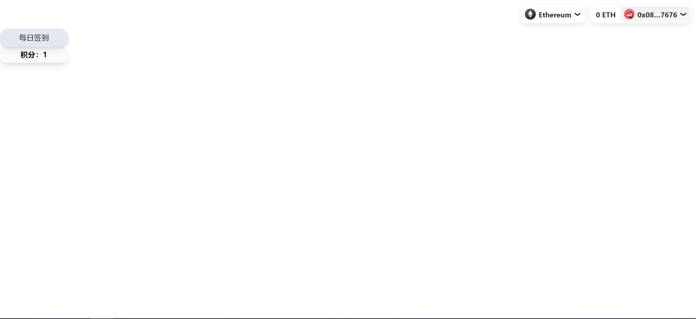

# 进行链上交互

在本小节中，我们将开始正式编写代码进行链上交互。

## 在开始之前

由于不能一直从 RainbowKit 的接口获得当前链接的钱包地址，因此需要用 redux 自己存储 address 的数据。

### 配置 redux

在`lib`文件夹下创建`redux`文件夹，在其中创建`store.js`和`addressSlice.js`，分别添加以下内容并保存：

```js title="addressSlice.js"
import { createSlice } from '@reduxjs/toolkit';

// 初始状态
const initialState = {
  address: null, // 初始化为 null，表示未登录
};

// 创建 slice
const addressSlice = createSlice({
  name: 'address',
  initialState,
  reducers: {
    setAddress: (state, action) => {
      state.address = action.payload; // 设置登录后的钱包地址
    },
  },
});

// 导出 action
export const { setAddress } = addressSlice.actions;

// 导出 reducer
export default addressSlice.reducer;
```


```js title="store.js"
import { configureStore } from "@reduxjs/toolkit";

import addressReducer from "./addressSlice";

export default configureStore({
    reducer: {
        address: addressReducer
    },
});
```

### 修改`provider.jsx`以管理`address`变量

由于在前面编写`provider.jsx`的时候，我们使用 RainbowKit 连接并断开了钱包，在此过程中应该对`address`变量的状态进行设置，具体需要更改的位置包括`fetchStatus`函数、`signOut`函数等。打开`app`文件夹下的`providers.jsx`文件，向其中添加如下代码：

```jsx
// highlight-next-line
import { useDispatch } from 'react-redux';
// highlight-next-line
import { setAddress } from '@/lib/redux/addressSlice';
...
export function Providers({ children }) {
  // highlight-next-line
  const dispatch = useDispatch();
  ...
  const fetchStatus = async () => {
    ...
    try {
      ...
      setAuthStatus(json.address ? 'authenticated' : 'unauthenticated');
      // highlight-next-line
      dispatch(setAddress(json.address));
    }
    ...
  }
  ...
  const signOut = async () => {
    setAuthStatus('unauthenticated');
    await fetch('/api/logout');
    // highlight-next-line
    dispatch(setAddress(null));
  }
  ...
}
```

打开`app`文件夹下的`layout.jsx`文件，添加以下代码：

```jsx
...
// highlight-next-line
import { Provider } from 'react-redux';
// highlight-next-line
import store from '@/lib/redux/store';
...
export default function RootLayout({ children }) {
  return (
    <html lang = "en">
      <body>
        // highlight-next-line
        <Provider store={store}>
          ...
        // highlight-next-line 
        </Provider>
      </body>
    </html>
  )
}
```


## 链上交互

接下来就正式开始链上交互，我们以在`mint`页面编写一个`签到/展示积分`按钮为例。

在`components`文件夹下创建新文件`Checkin.jsx`，并向其中填入以下代码：

```jsx title="Checkin.jsx"
"use client";

import React from 'react';

export const Checkin = () => {
  return (
    <div className="pr-[-50]">
        <button disabled={false} className={`rounded-full text-black h-[40px] font-[500] transition tracking-wide w-[150px] outline-none bg-slate-200 hover:bg-slate-300 drop-shadow-lg`} onClick={null}>
          每日签到
        </button>
        <p className={`rounded-[12px] text-black h-[35px] font-[600] transition tracking-wide w-[150px] outline-none bg-write hover:scale-110 bg-slate-50 shadow-lg flex justify-center items-center`}>
          积分：{String('1')}
        </p>
    </div>
  );
};
```

上述组件的外观采用 tailwindcss 来进行编写，省去了大量的 css 文件以及可能的 className 命名冲突。另外，tailwind 使用更加容易理解的 css 名称，使编写代码更加舒服。例如，让我们挨个解释一下上述的`<button />`组件中的 css 类名含义：

- **`rounded-full`：** 将元素的边框形状设为圆形，使元素的四个角变为圆角。
- **`text-black`：** 将文本颜色设置为黑色。
- **`h-[40px]`：** 将元素的高度设置为具体的像素值，这里是 40 像素。
- **`font-[500]`：** 设置元素的字体粗细为 500。在 Tailwind CSS 中，字体粗细通常用数字表示，`400` 表示正常（normal）粗细。
- **`transition`：** 启用 CSS 过渡效果。该类名表示在属性变化时会有平滑的过渡效果。
- **`tracking-wide`：** 增加文本字距，使文本间距变宽。
- **`w-[150px]`：** 将元素的宽度设置为具体的像素值，这里是 150 像素。
- **`outline-none`：** 移除元素的轮廓样式，通常用于去除默认的焦点轮廓。
- **`bg-slate-200`：** 设置元素的背景颜色为 Slate 200。Slate 是一种灰色调的颜色。
- **`hover:bg-slate-300`：** 当鼠标悬停在元素上时，将背景颜色更改为 Slate 300。
- **`drop-shadow-lg`：** 添加一个较大的阴影效果，使元素看起来有一定的立体感。

另外，上述 css 样式的顺序可以互换，不影响最终呈现的效果。如果想要使用其他效果样式，参见[官方文档](https://tailwindcss.com/docs/aspect-ratio)。

在`app`文件夹下创建一个文件夹`mint`，在其中创建一个`page.jsx`的文件，像其中填入以下代码：

```jsx title="mint/page.jsx"
"use client";

import { Checkin } from '@/components/Checkin';
import React from 'react';

const MintPage = () => {
  return (
    <>
      <Checkin />
    </>
  );
};

export default MintPage;
```

熟悉 React 的大家应该可以看出，以上是在`\mint`路由之下渲染出了`<Checkin />`组件，最终形成的界面如下图所示：


### 读合约

wagmi v1 中读合约的 hook 是`useContractRead`，其接受的参数以及返回值如下所示：

```jsx
const { 
    data,   // 返回数据
    isError,  // 是否发生错误
    error,  // 错误的话返回的错误消息
    isSuccess,  // 是否成功
    isLoading,  // 是否正在加载中
} = useContractRead({
    address: '0xecb504d39723b0be0e3a9aa33d646642d1051ee1',  // 合约地址
    abi: wagmigotchiABI,  // 合约 abi
    functionName: 'getHunger',  // 读取合约的函数
    // 下面为可选参数
    args: ['0xA0Cf798816D4b9b9866b5330EEa46a18382f251e'],  // 读合约时接受的参数
    chainId: 1,  // 该合约所在链的 id (主网是1, polygon是137, etc.)
    account: walletClient.account,   // 重载调用合约的钱包地址
})
```

在本例中，我们将要读取的数据是用户的积分，在使用上述方法读合约之前，需要对合约进行配置。首先在`lib`文件夹下创建`abi`文件夹，然后在其中分别创建`eggAbi.json`和`catAbi.json`。回到合约创建的[最后阶段](../../smart-contract/combination/#测试用例的编写和运行)，找到当时 hardhat 项目的文件，按照`artifacts/contracts/egg.sol/iCatEgg.json`和`artifacts/contracts/icat.sol/iCat.json`分别找到两个 abi 文件，分别复制其中`abi`项，然后分别复制到上述`eggAbi.json`和`catAbi.json`中。

然后在根目录下的`.env.local`文件中添加以下几行：

```env
#contracts
NEXT_PUBLIC_EGG_CONTRACT_ADDRESS=
NEXT_PUBLIC_ICAT_CONTRACT_ADDRESS=
```

其中分别填入[这里](../../smart-contract/deploy-contracts/#部署合约)获取到的两个合约地址。

之后打开`Checkin.jsx`，添加以下代码：

```jsx
import { useAccount, useContractRead, useContractWrite, usePrepareContractWrite,  } from "wagmi"
import { useSelector } from "react-redux";
import { useEffect } from "react";
import iCatAbi from "@/lib/abi/catAbi.json";
...

export const Checkin = () => {
  const address = useSelector(state => state.address.address);

  const { data } = useContractRead({
    address: process.env.NEXT_PUBLIC_ICAT_CONTRACT_ADDRESS,
    abi: iCatAbi,
    functionName: 'credit',
    args: [address]
  })
  ...
  return (
  	<div ...>
     	...
     	<p className={`rounded-[12px] text-black h-[35px] font-[600] transition tracking-wide w-[150px] outline-none bg-write hover:scale-110 bg-slate-50 shadow-lg flex justify-center items-center`}>
          积分：{String(data)}
        </p>
     </div>
  )
}
```

其中，`useEffect`的功能是让网页获取到`data`和`address`数据之后再次渲染。保存之后重新加载页面，这时就可以看到能够正常读取合约并返回数据了。


### 写合约

wagmi v1 中写合约使用的 hook 是`useContractWrite`，其接受的参数以及返回值如下所示：

```jsx
import { useContractWrite, parseGwei, parseEther } from 'wagmi'
const { 
    data,  // 返回数据
    isError,  // 是否发生错误
    error,  // 错误消息
    isLoading,  // 是否正在加载中
    isSuccess,  // 是否成功
    write,  // 写合约函数
} = useContractWrite({
    address: '0xecb504d39723b0be0e3a9aa33d646642d1051ee1',
    abi: wagmigotchiABI,
    functionName: 'feed',
    // 下面为可选参数
    args: [],
    chainId: 1,
    gas: 1_000_000n,  // 交易的 gas limit
    gasPrice: parseGwei('20'),  // 交易的 gas price(单位是gwei)
    nonce: 69,  // 指定交易nonce
    value: parseEther('0.1')  // 交易发送 ETH 数量(单位是wei)
})
```

另外，由于区块链上的每笔交易都会收取 gas 费，因此，wagmi 提供了一个提前预估交易是否成功的 hook `usePrepareContractWrite`。如果预估交易失败，则建议不执行。

其用法如下：

```jsx
const { config, error } = usePrepareContractWrite({
    address: '0xecb504d39723b0be0e3a9aa33d646642d1051ee1',
    abi: wagmigotchiABI,
    functionName: 'feed',
  })
const { write } = useContractWrite(config)
```

RainbowKit 还提供了一个`useAddRecentTransaction`用于将用户在前端执行的交易放到钱包最近交易历史记录里，用法如下：

```jsx
import { useAddRecentTransaction } from '@rainbow-me/rainbowkit';
export default () => {
  const addRecentTransaction = useAddRecentTransaction();
  return (
    <button
      onClick={() => {
        addRecentTransaction({
          hash: '0x...',
          description: '...',
        });
      }}
    >
      Add recent transaction
    </button>
  );
};
```


在本例子中，我们要写的合约是用户签到。打开`Checkin.jsx`，添加以下代码：

```jsx
...
import { useAddRecentTransaction } from "@rainbow-me/rainbowkit";

export const Checkin = () => {
  ...
  const { config, isError } = usePrepareContractWrite({
    address: process.env.NEXT_PUBLIC_ICAT_CONTRACT_ADDRESS,
    abi: iCatAbi,
    functionName: 'checkIn',
  });
  const { data: tx, isSuccess, write } = useContractWrite(config);

  const addRecentTransaction = useAddRecentTransaction();
    
  useEffect(() => {
    if (isSuccess) {
      addRecentTransaction({
        hash: tx?.hash || "",
        description: `每日签到`
      })
    }
  }, [data, tx, address, isError, write])
  
  return (
    <div ...>
      <button disabled={false} className={`rounded-full text-black h-[40px] font-[500] transition tracking-wide w-[150px] outline-none bg-slate-200 hover:bg-slate-300 drop-shadow-lg`} onClick={() => write?.()}>
        每日签到
      </button>  
      ...
    </div>
  )
}
```

之后先在链上铸造一个 iCat egg 以获得签到资格，然后重新渲染网页，就可以看到签到按钮可用，点击并在钱包确认后，点击 RainbowKit 钱包组件弹出钱包 Modal，显示以下界面，证明成功记录。


## 合并 component

上述两个功能应放在同一个位置以节省空间，具体操作方式就是通过检查 ICat 智能合约的`canCheckIn`接口，如果返回为`true`则显示签到按钮，如果返回为`false`则显示积分，具体修改代码如下：

```jsx
...
export const Checkin = () => {
  const address = useSelector(state => state.address.address);

  const { data: canCheckIn } = useContractRead({
    address: process.env.NEXT_PUBLIC_ICAT_CONTRACT_ADDRESS,
    abi: iCatAbi,
    functionName: 'canCheckIn',
    args: [address]
  })
  ...
  useEffect(() => {
    ...
  }, [data, tx, address, isError, write, canCheckIn])
  
  return (
    <div className="pr-[-50]">
      {
        canCheckIn
        ?
        <button ...>
          每日签到
        </button>
        :
        <p ...>
          积分：{String(data)}
        </p>
      }
    </div>
  )
}
```

至此，两个元素合为一体成为一个完整的 `<Checkin />`组件。