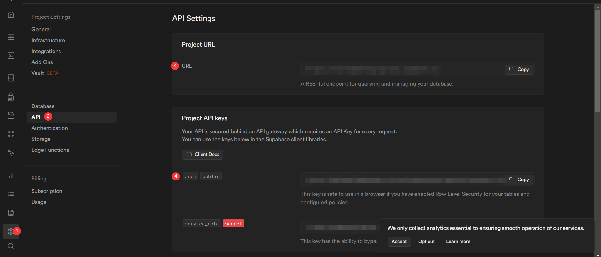

# 编写个人主页组件

个人主页应包含个人信息、拥有的iCat、egg和物品。我们会对这几个部分分别编写 components 然后引用进同一个页面。

## 编写后端

个人信息，包括头像、背景、昵称、简介等，属于隐私信息，而区块链具有开源是属性，因此个人信息不适合上传到区块链上，我们仍需要使用传统的数据库来存放隐私数据。

:::tip

Solidity 中的`private`类型并不能让数据真正的变成隐私数据。我们仍可以通过读取智能合约特定的 slot 来获取变量的值。

:::

你可以选用任何数据库来存放这些数据，这里我们使用提供免费 PostgreSQL 额度的 supabase 作为后端数据库。

### 配置 supabase

到[官网](https://supabase.com/dashboard/sign-up)注册，然后在[本页](https://supabase.com/dashboard/projects)选择`New project`，根据创建一个新的组织，在组织中创建一个新的项目，**如果你想要从外部连接数据库的话，请牢记创建项目时设置的数据库密码**。

创建成功后进入项目，根据下图的顺序依次复制数据库的 url 以及 public anon。


在前端项目根目录下的`.env.local`文件中加入以下两个环境变量：

```env
#supabase
NEXT_PUBLIC_SUPABASE_URL=
NEXT_PUBLIC_SUPABASE_ANON_KEY=
```

然后将上述复制的 url 以及 public anon 填入其中并保存。使用 VSCode 或其他软件连接上该数据库，在`public` scheme 下创建一张新表 users。表中数据项名称和类型如下所示（数据项：数据类型）：

- `uid`：uuid（用户唯一id，主键）
- `address`：text（用户钱包地址）
- `nick_name`：text（用户昵称）
- `avatar`：text（用户头像 url）
- `bio`：text（用户个人简介）
- `cover`：text（用户封面背景图 url）

### 编写后端接口

个人主页的后端接口应该能实现以下功能：

- 根据钱包地址获取个人信息；
- 如果结果为空则在`users`表中创建一个随机数据项并返回。

根据以上要求，在`pages/api`文件夹下创建`get_profile.js`文件，并粘贴以下内容：

```js
import { ironOptions } from '@/lib/iron';
import { createClient } from '@supabase/supabase-js';
import { withIronSessionApiRoute } from 'iron-session/next';
import { parse } from 'url';
import { v4 as uuid } from 'uuid';

const supabase = createClient(process.env.NEXT_PUBLIC_SUPABASE_URL, process.env.NEXT_PUBLIC_SUPABASE_ANON_KEY);


const handler = async (req, res) => {
  const { method, url } = req;
  const { query } = parse(url, true); // 解析查询参数

  switch (method) {
    case "GET":
      const address = query.address || "0x"; // 获取 nick_name 参数，如果没有则使用默认值
      const { data, error } = await supabase.from('users').select("*").eq('address', address);
      if(Object.keys(data).length === 0) {
        const { data: newData, error } = await supabase
          .from('users')
          .insert({
            uid: uuid(),
            address: address,
            nick_name:'User' + Math.floor(1000000 + Math.random() * 9000000).toString(),
            bio: "这个人很懒，还没有留下简介"
          })
          .select();
          res.send(newData);
      }
      else {
        res.send(data);
      }
      break;
    default:
      res.setHeader("Allow", ["GET"]);
      res.status(405).end(`Method ${method} Not Allowed`);
  }
};

export default withIronSessionApiRoute(handler, ironOptions);
```

## 编写前端

为了便于 debug，我们将个人主页（`Profile`）拆分成多个 components 进行编写。

### 头像（`ProfileImage`）

该组件接受`profile`参数并返回`ProfileImage`组件，如果`profile`不存在的话则返回默认头像。在`components`文件夹下创建`ProfileImage.jsx`，添加以下代码：

```jsx
import Image from "next/image";

export const ProfileImage = ({ profile }) => {
  return (
    <div className="px-8 pt-8 relative z-10 bg-transparent">
      {profile?.avatar ? (
        <Image
          src={profile?.avatar}
          alt=""
          width={200}
          height={200}
          className="relative rounded-full overflow-auto max-h-[800px]"
        />
      ) : (
        <Image
          src={"/images/defaultAvatar.png"}
          width={200}
          height={200}
          className='relative rounded-full overflow-auto max-h-[800px]'
        />
      )}
    </div>
  );
};
```

### 背景（`ProfileCover`）

该组件接受`profile`参数并返回`ProfileCover`组件，如果`profile`不存在的话则返回默认背景。在`components`文件夹下创建`ProfileCover.jsx`，添加以下代码：

```jsx
import Image from "next/image";

export const ProfileCover = ({ profile }) => {
  return (
    <div className="relative z-0 bg-local bg-clip-border bg-transparent bg-gradient-to-br from-gray-300 to-gray-300/25 bg-origin-padding bg-top box-border text-black block font-sans h-250px opacity-80 lg:w-screen md:h-full  h-[250px] antialiased">
      {profile?.cover ? (
        <Image
          src={profile?.cover}
          alt=""
          width={1706}
          height={133}
          className="relative bg-cover "
        />
      ) : (
        <Image
          src={"/images/defaultCover.png"}
          width={1706}
          height={133}
          className='relative bg-cover '
        />
      )}
    </div>
  );
};
```

### `EggCard`和`EggCards`

`EggCard`用于展示某个宠物蛋的图片以及操作按钮，`EggCards`用于展示该用户所拥有的所有宠物蛋。

```jsx title="EggCard.jsx"
import { useContractRead, useContractWrite, usePrepareContractWrite } from "wagmi";
import { useAddRecentTransaction } from "@rainbow-me/rainbowkit";
import { useEffect } from "react";
import { Avatar, Card } from "antd";
import eggAbi from "@/lib/abi/eggAbi";

const { Meta } = Card;

const EggCard = ({ tokenId }) => {

  const { data: metadata, isSuccess: isReadSuccess } = useContractRead({
    address: process.env.NEXT_PUBLIC_EGG_CONTRACT_ADDRESS,
    abi: eggAbi,
    functionName: 'tokenURI',
    args: [tokenId]
  })
    
  const { config } = usePrepareContractWrite({
    address: process.env.NEXT_PUBLIC_EGG_CONTRACT_ADDRESS,
    abi: eggAbi,
    functionName: 'hatchOut',
    args: [tokenId]
  });
  const { data, isLoading, isSuccess, write } = useContractWrite(config);
  const addRecentTransaction = useAddRecentTransaction();

  useEffect(() => {
    if (isSuccess) {
      addRecentTransaction({
        hash: data?.hash || "",
        description: "孵化"
      })
    }
    // console.log(metadata, typeof(metadata))
  }, [data, isSuccess, metadata, isReadSuccess])

  return (
    <Card
    className='w-72 hover:shadow-lg'
    cover={
    
      }
      actions={[
        <button disabled={!write} onClick={() => write?.()} className={`rounded-xl px-8 py-3 text-neutral-100 font-[500] transition tracking-wide w-[200px] outline-none ${isLoading ? "bg-emerald-500" : isSuccess ? 'bg-amber-400' : 'bg-blue-600 hover:bg-blue-700'}`}>
        {isLoading ? "孵化中..." : isSuccess ? "孵化成功！" : "孵化"}
      </button>
      ]}
    >
      <Meta
        avatar={<Avatar src="https://xsgames.co/randomusers/avatar.php?g=pixel" />}
        title={`iCat Egg #${tokenId}`}
        description="孵化扣除10积分"
      />
    </Card>
  )
}

export default EggCard;
```

```jsx title="EggCards.jsx"
import { useContractRead, useContractWrite, usePrepareContractWrite } from "wagmi";
import { Avatar, Card } from "antd";
import eggAbi from "@/lib/abi/eggAbi";
import { useEffect } from "react";
import EggCard from "./EggCard";

const { Meta } = Card;

const EggCards = ({ address }) => {

  const { data, isError, isSuccess, isLoading } = useContractRead({
    address: process.env.NEXT_PUBLIC_EGG_CONTRACT_ADDRESS,
    abi: eggAbi,
    functionName: 'getOwnedTokenId',
    args: [address]
  })

  const generatedElements = !!data &&
    (
      data?.[0].length == 0 ?
      <div className="pb-20">
      <p>还没有iCat哦，快去铸造一个吧！</p>
    </div>
    :
      data[0].map(tokenId => (
        <EggCard key={tokenId} tokenId={tokenId} />
      ))
    );

  useEffect(() => {
    // console.log(data)
  }, [data, isSuccess])
  
  return (
    <div className='flex flex-row flex-wrap gap-4 pt-8 pb-20'>
      {generatedElements}
    </div>
  )
}

export default EggCards;
```

### `CatCard`和`CatCards`

`CatCard`用于展示某个宠物猫的图片以及详情链接，`CatCards`用于展示该用户所拥有的所有宠物猫。

```jsx title="CatCard.jsx"
import { useContractReads } from "wagmi";
import iCatAbi from "@/lib/abi/catAbi";
import { useEffect } from "react";
import Link from "next/link";
import { Avatar, Card } from "antd";

const CatCard = ({ tokenId }) => {

  const iCatCA = {
    address: process.env.NEXT_PUBLIC_ICAT_CONTRACT_ADDRESS,
    abi: iCatAbi
  };

  const { data, isSuccess, isLoading, isError } = useContractReads({
    contracts: [
      {
        ...iCatCA,
        functionName: 'detail',
        args: [tokenId]
      },
      {
        ...iCatCA,
        functionName: 'tokenURI',
        args: [tokenId]
      }
    ]
  });

  const stage = {
    0: "幼生期",
    1: "成长期",
    2: "成熟期"
  }

  useEffect(() => {
    // console.log(data); // eslint-disable-line no-console
  }, [data, isSuccess])

  return (
    <Link href={`/asset/${tokenId.toString()}`} key={tokenId}>
      <Card
        className='w-72 hover:shadow-lg cursor-pointer'
        cover={
          
        }
        loading={!isSuccess}
      >
        <Card.Meta
        avatar={<Avatar />}
          title={`iCat #${tokenId} ${!!data ? data[0]?.result[0] : 'unknown'}`}
          description={stage[data?.[0].result[3]]}
        />
      </Card>
    </Link>
  )
}

export default CatCard;
```

```jsx title="CatCards.jsx"
import { useContractRead } from "wagmi";
import { Avatar, Card } from "antd";
import icatAbi from "@/lib/abi/catAbi";
import { useEffect } from "react";
import CatCard from "./CatCard";

const { Meta } = Card;

const CatCards = ({ address }) => {

  const { data, isError, isSuccess, isLoading } = useContractRead({
    address: process.env.NEXT_PUBLIC_ICAT_CONTRACT_ADDRESS,
    abi: icatAbi,
    functionName: 'getOwnedTokenId',
    args: [address]
  })

  const generatedElements = !!data &&
    (
      data?.[0].length == 0 ?
      <div>
      <p>还没有iCat哦，快去铸造一个吧！</p>
    </div>
    :
      data[0].map(tokenId => (
        <CatCard key={tokenId} tokenId={tokenId} />
      ))
    );

  useEffect(() => {
    // console.log(data, isSuccess)
  }, [data, isSuccess])

  return (
    <div className='flex flex-row flex-wrap gap-4 pt-8 pb-20'>
      {generatedElements}
    </div>
  )
}

export default CatCards;
```

### `FoodCard`

`FoodCard`用于展示用户所拥有的某种食物的数量。在`components`文件夹下创建`FoodCard.jsx`，并填入以下代码：

```jsx title="FoodCard.jsx"
import { Avatar, Card } from "antd"
import { useAccount, useContractRead, useContractWrite, usePrepareContractWrite } from "wagmi"
import { ContractFunctionExecutionError } from "viem";
import iCatAbi from "@/lib/abi/catAbi.json";
import { useEffect, useState } from "react";
import { useAddRecentTransaction } from "@rainbow-me/rainbowkit";
import { toast, Toaster } from "react-hot-toast";

export const FoodCard = ({ style }) => {

  const { address } = useAccount();
  const [amount, setAmount] = useState(undefined);

  const food = {
    'leftover': 0,
    'fishchip': 1,
    'tin': 2
  }

  const foodTrans = {
    'leftover': '剩饭',
    'fishchip': '小鱼干',
    'tin': '鱼罐头'
  }

  const { data, isError } = useContractRead({
    address: process.env.NEXT_PUBLIC_ICAT_CONTRACT_ADDRESS,
    abi: iCatAbi,
    functionName: 'foodBalance',
    args: [address, food[style]]
  })

  const { config, error } = usePrepareContractWrite({
    address: process.env.NEXT_PUBLIC_ICAT_CONTRACT_ADDRESS,
    abi: iCatAbi,
    functionName: 'buyFood',
    args: [food[style], amount]
  })
  const { data: tx, isLoading, isSuccess, write } = useContractWrite(config);
  const addRecentTransaction = useAddRecentTransaction();

  useEffect(() => {
    // console.log(data, error)
    if (isSuccess) {
      addRecentTransaction({
        hash: tx?.hash || "",
        description: `购买${foodTrans[style]}`
      })
    }
    if (error instanceof ContractFunctionExecutionError) {
      // console.log('message:', error.metaMessages)
      if (error.metaMessages[0] == "Error: creditNotEnough()") {
        toast.error("积分不足！");
      }
    }
  }, [data, isError, isSuccess, error])

  return (
    <div className="hover:drop-shadow-lg">
      <Card
        cover={
          </img>
        }
        actions={[
          <div className="flex items-center space-x-2 justify-center">
            <input 
              className="bg-gray-100 rounded-full h-[30px] pl-3 w-[130px]"
              type="number"
              placeholder="请输入数量"
              value={amount}
              onChange={a => {setAmount(a.target.value)}}
            />
            <button disabled={!write} onClick={() => write?.()} className={`rounded-xl text-neutral-100 font-[100] transition tracking-wide w-[90px] h-[30px] outline-none ${isLoading ? "bg-emerald-500" : isSuccess ? 'bg-amber-400' : 'bg-blue-600 hover:bg-blue-700'}`}>
              {isLoading ? `购买中...` : isSuccess ? `购买成功！` : `购买${foodTrans[style]}`}
            </button>
          </div>
        ]}
      >
        <Card.Meta 
          avatar={<Avatar src="https://xsgames.co/randomusers/avatar.php?g=pixel" />}
          title={`${foodTrans[style]}`}
          description={`余额：${data}个`}
        />
      </Card>
    </div>
  )
}
```


### `OrnamentCard`

`OrnamentCard`用于展示用户拥有的装饰品数量。在`components`文件夹下创建`OrnamentCard.jsx`文件，并填入以下代码：

```jsx title="OrnamentCard.jsx"
import { Avatar, Card } from "antd"
import { useAccount, useContractRead, useContractWrite, usePrepareContractWrite } from "wagmi"
import { ContractFunctionExecutionError } from "viem";
import iCatAbi from "@/lib/abi/catAbi.json";
import { useEffect, useState } from "react";
import { useAddRecentTransaction } from "@rainbow-me/rainbowkit";
import { toast, Toaster } from "react-hot-toast";

export const OrnamentCard = ({ style }) => {

  const { address } = useAccount();
  const [amount, setAmount] = useState(undefined);

  const ornament = {
    'hat': 0,
    'scarf': 1,
    'clothes': 2
  }

  const ornamentTrans = {
    'hat': '帽子',
    'scarf': '围巾',
    'clothes': '衣服'
  }

  const { data, isError } = useContractRead({
    address: process.env.NEXT_PUBLIC_ICAT_CONTRACT_ADDRESS,
    abi: iCatAbi,
    functionName: 'ornamentBalance',
    args: [address, ornament[style]]
  })

  const { config, error } = usePrepareContractWrite({
    address: process.env.NEXT_PUBLIC_ICAT_CONTRACT_ADDRESS,
    abi: iCatAbi,
    functionName: 'buyOrnament',
    args: [ornament[style], amount]
  })
  const { data: tx, isLoading, isSuccess, write } = useContractWrite(config);
  const addRecentTransaction = useAddRecentTransaction();

  useEffect(() => {
    // console.log(data, error)
    if (isSuccess) {
      addRecentTransaction({
        hash: tx?.hash || "",
        description: `购买${ornamentTrans[style]}`
      })
    }
    if (error instanceof ContractFunctionExecutionError) {
      // console.log('message:', error.metaMessages)
      if (error.metaMessages[0] == "Error: creditNotEnough()") {
        toast.error("积分不足！");
      }
    }
  }, [data, isError, isSuccess, error])

  return (
    <div className="hover:drop-shadow-lg">
      <Card
        cover={
          </img>
        }
        actions={[
          <div className="flex items-center space-x-2 justify-center">
            <input 
              className="bg-gray-100 rounded-full h-[30px] pl-3 w-[130px]"
              type="number"
              placeholder="请输入数量"
              value={amount}
              onChange={a => {setAmount(a.target.value)}}
            />
            <button disabled={!write} onClick={() => write?.()} className={`rounded-xl text-neutral-100 font-[100] transition tracking-wide w-[90px] h-[30px] outline-none ${isLoading ? "bg-emerald-500" : isSuccess ? 'bg-amber-400' : 'bg-blue-600 hover:bg-blue-700'}`}>
              {isLoading ? `购买中...` : isSuccess ? `购买成功！` : `购买${ornamentTrans[style]}`}
            </button>
          </div>
        ]}
      >
        <Card.Meta 
          avatar={<Avatar src="https://xsgames.co/randomusers/avatar.php?g=pixel" />}
          title={`${ornamentTrans[style]}`}
          description={`余额：${data}个`}
        />
      </Card>
    </div>
  )
}
```


### `MedicineCard`

`MedicineCard`用于展示用户拥有的药品数量。在`components`文件夹下面创建`MedicineCard.jsx`文件，并填入以下代码：

```jsx title="MedicineCard.jsx"
import { Avatar, Card } from "antd"
import { useAccount, useContractRead, useContractWrite, usePrepareContractWrite } from "wagmi"
import { ContractFunctionExecutionError } from "viem";
import iCatAbi from "@/lib/abi/catAbi.json";
import { useEffect, useState } from "react";
import { useAddRecentTransaction } from "@rainbow-me/rainbowkit";
import { toast, Toaster } from "react-hot-toast";

export const MedicineCard = () => {

  const { address } = useAccount();
  const [amount, setAmount] = useState(undefined);

  const { data, isError } = useContractRead({
    address: process.env.NEXT_PUBLIC_ICAT_CONTRACT_ADDRESS,
    abi: iCatAbi,
    functionName: 'medicine',
    args: [address]
  })

  const { config, error } = usePrepareContractWrite({
    address: process.env.NEXT_PUBLIC_ICAT_CONTRACT_ADDRESS,
    abi: iCatAbi,
    functionName: 'buyMedicine',
    args: [amount]
  })
  const { data: tx, isLoading, isSuccess, write } = useContractWrite(config);
  const addRecentTransaction = useAddRecentTransaction();

  useEffect(() => {
    // console.log(data, error)
    if (isSuccess) {
      addRecentTransaction({
        hash: tx?.hash || "",
        description: `购买药品`
      })
    }
    if (error instanceof ContractFunctionExecutionError) {
      // console.log('message:', error.metaMessages)
      if (error.metaMessages[0] == "Error: creditNotEnough()") {
        toast.error("积分不足！");
      }
    }
  }, [data, isError, isSuccess, error])

  return (
    <div className="hover:drop-shadow-lg">
      <Card
        cover={
          </img>
        }
        actions={[
          <div className="flex items-center space-x-2 justify-center">
            <input 
              className="bg-gray-100 rounded-full h-[30px] pl-3 w-[130px]"
              type="number"
              placeholder="请输入数量"
              value={amount}
              onChange={a => {setAmount(a.target.value)}}
            />
            <button disabled={!write} onClick={() => write?.()} className={`rounded-xl text-neutral-100 font-[100] transition tracking-wide w-[90px] h-[30px] outline-none ${isLoading ? "bg-emerald-500" : isSuccess ? 'bg-amber-400' : 'bg-blue-600 hover:bg-blue-700'}`}>
              {isLoading ? `购买中...` : isSuccess ? `购买成功！` : `购买药品`}
            </button>
          </div>
        ]}
      >
        <Card.Meta 
          avatar={<Avatar src="https://xsgames.co/randomusers/avatar.php?g=pixel" />}
          title={`药品`}
          description={`余额：${data}个`}
        />
      </Card>
    </div>
  )
}
```


### `Stuff`

`Stuff`组件用于存放上述`EggCards`、`FoodCards`和`MedicineCard`组件。在`components`文件夹下面创建`Stuff.jsx`文件，并填入以下代码：

```jsx title="Stuff.jsx"
import { List } from "antd"
import { FoodCard } from "./FoodCard";
import { MedicineCard } from "./MedicineCard";
import { OrnamentCard } from "./OrnamentCard";

export const Stuff = () => {
  const listData = [
    <div className="flex flex-col space-y-3">
      <p className="font-semibold">猫粮</p>
      <div className="flex flex-row flex-wrap gap-4 pt-8 pb-20">
        <FoodCard style={"leftover"} />
        <FoodCard style={"fishchip"} />
        <FoodCard style={"tin"} />
      </div>
    </div>,
    <div className="flex flex-col space-y-3">
      <p className="font-semibold">饰品</p>
      <div className="flex flex-row flex-wrap gap-4 pt-8 pb-20">
        <OrnamentCard style={"hat"} />
        <OrnamentCard style={"scarf"} />
        <OrnamentCard style={"clothes"} />
      </div>
    </div>,
    <div className="flex flex-col space-y-3">
      <p className="font-semibold">药品</p>
      <div className="flex flex-row flex-wrap gap-4 pt-8 pb-20">
        <MedicineCard />
      </div>
    </div>,
  ];

  return (
    <div className="flex flex-col">
      <List
        dataSource={listData}
        bordered
        renderItem={(item) => (
          <List.Item>{item}</List.Item>
        )}
      />
    </div>
  )
}
```

在`Stuff`中，我们使用`ant-design`库中的`<List />`组件来为其中包含的组件排序。
